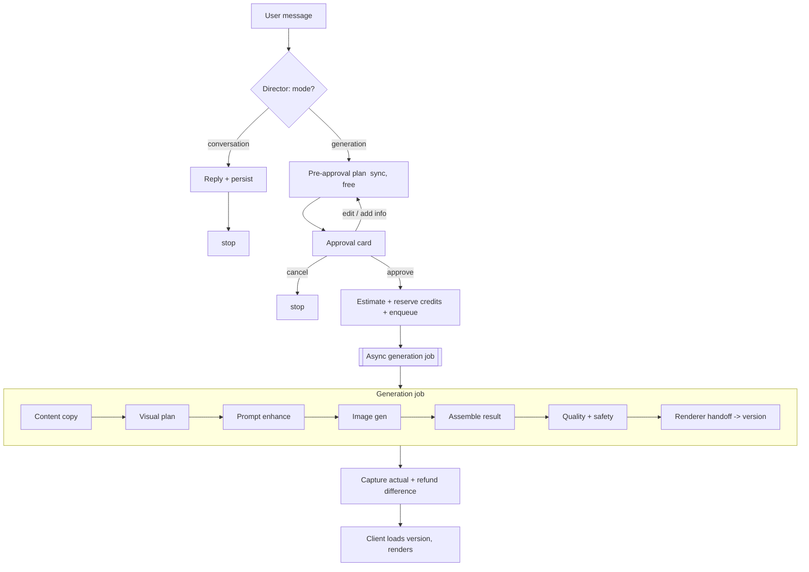

# Orra AI Workflow Architecture

Version 1.0
Scope: the complete AI orchestration. Roles, modes, planning, approval, generation, prompt enhancement, brand and asset handling, region editing, provider routing, job lifecycle, failure, cost, quality, safety, and renderer handoff.
Builds on: the document model and kernel, the async generation pipeline, and the reserve-capture-refund credit ledger from the prior designs. Those are referenced, not re-explained.
No implementation code. Schemas and signatures appear as design only.

---

## 0. Stance: this is not a chatbot, it is a planner that emits kernel actions

A generic chatbot answers. Orra's AI does something narrower and stranger: it decides whether the user is talking or directing, and when directing, it produces a plan, gets approval, and then emits **kernel actions against the document model**. It never writes pixels with text in them, never touches the canvas, and never spends a credit until the user approves.

Three decisions follow from designing for Orra specifically rather than for a chat assistant, and the rest of the document depends on them:

1. **Intent detection and the Director are one call, not two.** A separate classifier hop adds latency for no benefit, because the approval gate already makes misclassification cheap: a false "generation" produces an approval card the user dismisses, a false "conversation" makes the user repeat themselves. Neither spends credits. So one Director call returns a structured result with a `mode` field and either a reply or a plan.

2. **Planning has two depths, and only the second costs credits.** The cheap, fast, free, synchronous **pre-approval plan** is enough to render the approval card and let the user iterate on direction for free. The expensive, asynchronous **post-approval generation** is the only thing that consumes credits. Conflating these is how products end up charging for rejected plans.

3. **The ten roles are seams, not models.** In V1 they map onto one text model, one vision model, one image model, and the app renderer. They stay separate in the architecture so any one can move to a different provider or a fine-tuned model later without changing callers.

---

## 1. The ten AI roles as logical seams

Each role is a capability plus a contract, not a deployed model. The V1 physical mapping is deliberately small.

| # | Role | What it does | V1 physical model |
| --- | --- | --- | --- |
| 1 | Conversation and Director AI | Detects mode; replies, or produces the internal plan | Gemini 2.5 Flash Lite (text) |
| 2 | Intent classifier | A structured field of the Director call, not a separate hop | (folded into role 1) |
| 3 | Content and copy generation | Final per-card copy in brand tone | Gemini 2.5 Flash Lite (text) |
| 4 | Visual planner | Per-card layer plan: layout, roles, positions | Gemini 2.5 Flash Lite (text) |
| 5 | Prompt enhancer | Short prompt to detailed image prompt, internal | Gemini 2.5 Flash Lite (text) |
| 6 | Image understanding | Analyzes uploaded assets and region scenes | Gemini 2.5 Flash Lite (vision) |
| 7 | Image generation | Backgrounds, transparent objects, transformations | FLUX Schnell (cheap), FLUX Kontext Pro / Gemini Flash Image (edit, premium) |
| 8 | Region editing workflow | Vision plus enhancer plus image, non-destructive | composite of 6, 5, 7 |
| 9 | Quality checker | Validates output, raises warnings, can trigger one re-gen | vision plus deterministic checks |
| 10 | Renderer handoff | Converts generation result to kernel actions and a version | not a model; the boundary to the renderer subsystem |

Roles 1, 3, 4, 5 are the same text model with different system prompts in V1. They are listed separately because that is where the future split happens (a cheaper nano model for classification, a stronger model for copy, a fine-tuned planner) with no change to the pipeline that calls them.

---

## 2. AI workflow diagram in text form (deliverable 1)

Text outline of the full flow:

```
User message
  -> Director (sync, free): { mode, ... }
     -> mode = conversation: reply, persist, stop
     -> mode = generation:
          -> pre-approval plan (sync, free)
               - cheap vision on uploaded assets if needed
               - resolve brand context
               - produce InternalPlan
          -> derive ApprovalCard (lightweight) and show it
          -> user: approve | edit direction | add info | cancel
               - edit/add: re-plan (still free), re-show card
               - cancel: stop
               - approve:
                    -> estimate max cost, reserve credits, create job, enqueue
                    -> ASYNC generation job (consumes credits):
                         - Content AI: per-card copy
                         - Visual Planner: per-card layer plan
                         - Prompt Enhancer: per-card image prompts
                         - Image model: backgrounds (dedupe by hash)
                         - assemble GenerationResult
                         - Quality + safety checks
                         - Renderer handoff: kernel actions -> new artifact_version
                         - capture actual cost, refund difference
                    -> client polls job, loads version, renders
```

As a diagram:



---

## 3. Conversation mode flow (deliverable 2)

Triggered when the Director returns `mode = conversation`: brainstorming, context, questions, refining direction.

- The Director replies as a normal assistant, persists the assistant message, and stops.
- No plan, no approval card, no job, no credits.
- The conversation is context for later generation. When the user eventually issues a creation action, the Director has the prior turns in the thread to draw direction from, so "make that into a carousel" works because "that" was established in conversation.
- Conversation is fully free and synchronous. It is the cheap surface where direction is shaped before any credits are at stake.

The one nuance: a message can carry both context and a creation action ("I want a calm tone, now make 5 cards about discipline"). The Director resolves to `generation` and folds the context into the plan. Mode is about the action in the message, not its length.

---

## 4. Generation mode flow (deliverable 3)

Triggered when the Director returns `mode = generation` for a creation action (create a post, create a carousel, make 5 cards, generate a background, turn this into a post, make this happen).

1. **Pre-approval plan (synchronous, free).** The Director, in planning mode, produces an `InternalPlan`. If the message references uploaded assets, cheap vision analysis runs here (it is a few seconds, acceptable in the request path; if it ever exceeds budget, promote planning to a short async job). Brand context is resolved if a brand is attached.
2. **Default to action; ask only critical questions.** The plan uses smart defaults and records them as `assumptions`. It only sets a `blockingQuestion` when a detail is truly blocking: "use my brand" with no brand attached, "use the uploaded image" with no upload, a required CTA missing, or an uninterpretable request. Everything else becomes an assumption shown in the card.
3. **Interpretation rules.** "Create 5 cards about self-improvement" is one carousel with five cards, never five artifacts. A bare "create a post" is a single-card artifact. These are encoded in the Director's system prompt and validated by the plan schema.
4. **Approval card.** The lightweight, non-technical `ApprovalCard` is derived from the plan and shown with the planning state. The user approves, edits direction, adds missing info, or cancels. Edits re-plan for free and re-show the card.
5. **On approve.** Estimate the maximum cost, reserve credits, create the job, enqueue. Only now do credits move.
6. **Async generation** produces the artifact and hands off to the renderer.

The user never sees the `InternalPlan`. They see only the `ApprovalCard`.

---

## 5. Internal planning schema (deliverable 4, hidden from the user)

```ts
interface InternalPlan {
  artifactType: 'post' | 'carousel';
  cardCount: number;                 // 1 for a post
  ratio: Ratio;                      // resolved from project or smart default
  brandUsage: {
    brandSystemId: string | null;
    applyTone: boolean;
    applyPalette: boolean;
    applyFonts: boolean;
    placeLogo: boolean;
  };
  cards: PlannedCard[];
  ctaState: 'none' | 'pending' | { text: string };
  assumptions: string[];             // surfaced lightly in the card
  blockingQuestion?: string;         // set only when truly blocking
  premium: boolean;                  // premium image tier requested?
}

interface PlannedCard {
  index: number;
  role: 'cover' | 'content' | 'cta' | 'single';
  contentOutline: string;            // not final copy yet
  visualDirection: string;           // style descriptors, not an enhanced prompt
  needsBackgroundGeneration: boolean;
  useAssetId?: string;               // if an uploaded asset should back this card
}
```

This is the planning artifact, deliberately richer than the card. It carries enough to estimate cost (count of `needsBackgroundGeneration`, `premium`) and enough to generate later, but it is never shown raw. Final copy and enhanced image prompts are produced in the async job, not here, so planning stays cheap and free.

---

## 6. Lightweight approval card schema (deliverable 5, shown to the user)

```ts
interface ApprovalCard {
  summaryLine: string;     // "Ready to create a 5-card carousel about self-improvement."
  style: string;           // "calm, premium, focused"
  format: string;          // "Instagram 4:5"
  brand: string;           // "Selected brand system" | "No brand"
  cta: string;             // "Not set" | the CTA text
  assumptions: string[];   // short, plain-language, optional
  actions: ApprovalAction[];
}

type ApprovalAction =
  | 'approve_and_create'
  | 'add_cta'
  | 'edit_direction'
  | 'cancel';
```

Rules: no image prompts, no layer plans, no model names, no token counts, no technical language. It is a one-glance confirmation, matching the source-of-truth example. `edit_direction` and `add_cta` re-run planning for free. `approve_and_create` is the only action that triggers credits.

---

## 7. Artifact generation schema (deliverable 6, the async job's internal output)

The job's intermediate result, before it becomes kernel actions:

```ts
interface GenerationResult {
  artifactType: 'post' | 'carousel';
  ratio: Ratio;
  cards: GeneratedCard[];
  brandContextSnapshot: object;      // pinned for reproducibility
  warnings: QualityWarning[];
}

interface GeneratedCard {
  index: number;
  backgroundAssetId?: string;        // generated or reused (deduped) project asset
  copy: GeneratedCopy[];             // becomes text layers
  objects?: { assetId: string; box: Box }[]; // any planned objects
  logoPlacement?: { assetId: string; box: Box }; // pinned brand logo copy
}

interface GeneratedCopy {
  content: string;
  role: 'title' | 'body' | 'cta' | 'label'; // visual role only; ONE text layer type
  suggestedStyle: TextStyleHint;     // font/size/weight/color from brand or defaults
  box: Box;
}
```

Important: `role` here is a visual hint for placement and styling, not a layer subtype. Every piece of copy becomes the single `TextLayer` type. The image model produces only `backgroundAssetId` and `objects`, never text. All readable text is `GeneratedCopy` that the renderer draws as editable layers. This is the product rule, enforced at the schema boundary.

---

## 8. Prompt enhancement flow (deliverable 7, internal)

Short user direction or a card's `visualDirection` becomes a detailed image prompt:

```
inputs:
  - card visualDirection (or short user prompt)
  - brand visual descriptor (palette, style; see section 9)
  - card role (cover vs content changes composition)
  - ratio (aspect guidance)
output: a detailed prompt covering
  - scene, subject, composition
  - lighting and mood
  - color guidance (brand palette if applicable)
  - texture and style
  - explicit empty space reserved for text
  - hard negatives: NO text, NO watermark, NO logo unless explicitly requested
```

The enhanced prompt is internal and not shown by default. Two properties matter for Orra: it always reserves empty space for the app-rendered text, and it always forbids baked text. The enhancer is also where brand visual direction enters image generation. Enhancement results are cached by a hash of all inputs (section 15) so re-runs and similar cards are free.

---

## 9. Brand context injection strategy (deliverable 8)

When a brand system is attached, its parts route to the roles that need them:

- **Tone of voice** to the Content AI, shaping copy.
- **Palette and visual direction** to the Visual Planner and Prompt Enhancer.
- **Fonts and colors** to the text-layer style hints.
- **Logo** placed as an immutable `LogoLayer` from a pinned project copy, never altered.
- **Rules** to all text roles as constraints.

The non-obvious optimization: **reference images are analyzed once, not every generation.** When a user adds reference images to a brand, run vision once to produce a cached `brandVisualDescriptor` (style, palette, mood in words) stored on the brand system. Generations inject that text descriptor rather than re-analyzing images each time. This cuts latency and cost and gives a stable brand voice.

Without a brand: the plan infers defaults from the prompt and conversation, records them as assumptions, and only asks if a brand was explicitly requested but none is attached. The brand context that was actually used is snapshotted onto the generation (`brandContextSnapshot`) for reproducibility, since brands are mutable.

---

## 10. Uploaded asset analysis strategy (deliverable 9)

When the user uploads assets, image understanding runs and the result is cached on the asset row, so it is computed once:

```
analysis per asset:
  - kind guess: background | product | logo | reference | photo
  - description (subject, scene)
  - dominant colors
  - orientation and aspect
  - hasEmptySpace (can text sit on it?)
  - quality flags (low res, busy, watermark present)
```

The plan uses this to decide placement: a clean wide image with empty space becomes a `BackgroundLayer`; a product shot becomes an `ImageLayer` or an `ObjectLayer`; a transparent mark is treated as a logo-like asset. Analysis at plan time is acceptable latency for a couple of images and is cached so editing the plan or regenerating does not re-pay for it.

---

## 11. Region-based editing strategy (deliverable 10)

Non-destructive, scene-aware, additive. The user selects a region and gives an instruction ("add a dog here").

```
1. Image understanding on the card background + region context:
     lighting, perspective, scale cue, palette, mood, style.
2. Prompt enhancer builds a transparent-object prompt conditioned on that scene,
     so the object matches rather than looks pasted.
3. Image model generates a transparent object:
     prefer a model/path that yields clean alpha (FLUX Kontext Pro / Gemini Flash Image).
4. If clean alpha is not produced, run a background-removal step to matte it.
     Never repaint the card background.
5. Store as a project asset; apply ONE addLayer action creating an ObjectLayer
     at the region with regionOrigin set.
6. New version; the object is a normal editable layer.
```

The "when possible" in the requirement is honored at step 4: the goal is an editable object layer, and the fallback is matting, but the background is never touched. Requests that imply repainting the scene (remove, relight, fix) are out of scope for V1 and are steered by the Director toward background regeneration or an additive object, because there is no destructive edit path.

---

## 12. Provider router design (deliverable 11)

Capability-typed interfaces, never a concrete provider, exposed to the pipeline:

```ts
interface TextModel  { complete(messages, opts): Promise<TextOut> }
interface VisionModel{ analyze(image, prompt, opts): Promise<VisionOut> }
interface ImageModel {
  generate(prompt, opts): Promise<ImageOut>;            // opaque
  generateTransparent(prompt, opts): Promise<ImageOut>; // alpha
}
```

Each capability has a router configured (not hardcoded) with:

- **Tiers**: a cheap default and a premium option. Cheap is used unless the plan sets `premium` or a role demands it (image editing uses the premium edit model).
- **Ordered fallbacks**: on failure, try the next provider for the same capability.
- **Timeouts** per call, sized to the capability (text seconds, image tens of seconds).
- **Retries**: bounded, with jittered backoff, only on transient errors (timeout, 5xx, rate limit).
- **Circuit breaking**: a provider returning sustained errors or rate limits is skipped temporarily so the router fails over fast instead of retrying a sick provider.
- **Cost tracking**: every call logs `{capability, provider, tier, units, latency, cost}` to the provider-call log, which feeds the cost estimator.
- **Idempotent image retries**: dedupe by content hash so a retry does not pay a provider twice for the same prompt.

Adapters wrap each concrete provider and normalize request and response shapes. Adding or swapping a provider is a config and adapter change, never a pipeline change. V1 routing: text and vision default to Gemini 2.5 Flash Lite with GPT-5 nano as a text fallback; image defaults to FLUX Schnell with Gemini Flash Image as fallback, and edits use FLUX Kontext Pro with Gemini Flash Image as fallback.

---

## 13. AI job lifecycle (deliverable 12)

```
queued -> running -> (succeeded | partial | failed)
```

- **Submit (sync)**: estimate max cost, `reserve` credits, insert the job with an idempotency key, enqueue `{jobId}`.
- **Pick up (async)**: the consumer transitions `queued -> running` behind a guard. If the job is not `queued`, it is a duplicate delivery and is acked without work. This makes the consumer idempotent against at-least-once delivery.
- **Steps**: content, visual plan, prompt enhance, image gen, assemble, quality and safety, renderer handoff. Each step is recorded (section 19) for observability and cost.
- **Finish**: on success, write the artifact version, set `result_version_id`, `capture` actual cost, `refund` the difference, mark `succeeded`. On partial, persist good cards, capture only for delivered work, refund the rest, mark `partial`. On failure, `refund` the full reservation, mark `failed`.

A reservation is never orphaned: it is captured, refunded, or held by a still-running job that the dead-letter handler will resolve.

---

## 14. Failure handling (deliverable 13)

| Failure | Handling |
| --- | --- |
| Provider timeout or 5xx | Router retries with backoff, then fails over to the next provider |
| Provider rate limited | Circuit-break that provider, fail over |
| All providers exhausted for a step | Step fails; job goes partial or failed |
| Malformed model output (invalid plan or actions) | Re-prompt once with stricter constraints, then fail the step |
| Invalid kernel action or non-catalog font from AI | Kernel rejects; re-prompt or drop the offending layer; never corrupt the document |
| Partial carousel | Persist good cards, flag failed ones, capture partial, refund rest, allow retry of just the failed card |
| Safety block | Fail the job, full refund, neutral user message; no artifact produced |
| Duplicate queue delivery | Consumer guard skips non-queued jobs |
| Max retries reached | Dead-letter handler marks failed and refunds |

The invariant: AI output reaches the document only through validated kernel actions applied after a pre-AI snapshot, so a failed or malicious generation cannot corrupt a good artifact, and a failed job never charges the user.

---

## 15. Cost control strategy (deliverable 14)

- **Free is free.** Conversation, planning, approval-card iteration, brand and asset analysis (cached), manual edits, and export cost no credits. Only image generation, object generation, region edits, premium generation, and full carousel generation consume credits.
- **Cheap default.** The router uses the cheap text and image tiers unless premium is explicitly requested or a role requires the edit model.
- **Caching.** Prompt-enhancement results are cached by a hash of all inputs (direction, brand descriptor, role, ratio). Identical background generations are deduped by content hash so retries and similar cards reuse bytes. Brand visual descriptors and asset analyses are computed once and cached.
- **Estimate then true up.** The estimator prices the plan by counting chargeable steps using the provider-call cost log, reserves the maximum, and captures actual, refunding the difference. The user is never overcharged.
- **Concurrency caps.** A per-workspace in-flight job cap protects provider rate limits and prevents one tenant from saturating the consumer.
- **Calibration.** The provider-call log continuously refines unit costs so estimates track reality as providers and prices change.

---

## 16. Quality checker and safety (deliverable 15)

Two layers run after assembly. Quality raises advisory warnings and may trigger at most one targeted re-generation. Safety can block.

Quality rules (warn, or auto-fix once, never silently block):

- **No baked text.** Vision-check generated backgrounds for unwanted text or watermarks; flag, and re-generate that one background once if found.
- **Brand adherence.** Palette used, logo present when required, fonts from catalog.
- **Readability.** Contrast of each text layer against the background beneath it (computed at render), overflow, minimum size, occlusion (from the rendering subsystem).
- **Spelling.** App-rendered copy is checked for obvious errors, since copy is model-generated.
- **Layout sanity.** Text within safe zones, layers within bounds.

Safety checks (block, refund, neutral message):

- **Input safety** on the user's prompt and uploaded assets.
- **Output safety** via vision on generated images.
- Disallowed content is refused before it can produce or persist an artifact. Safety overrides helpfulness and is not bypassable by prompt framing.

Quality warnings are surfaced to the user and to the Director so the next turn can offer fixes; they keep the user in control rather than blocking. Safety blocks are firm.

---

## 17. How AI hands off to the renderer (deliverable 16)

The handoff is a hard, narrow boundary:

```
GenerationResult
  -> mapped to kernel actions (addCard, addLayer with TextLayer / Background / Object / Logo)
  -> kernel validates and applies server-side
  -> new artifact_version written, becomes current
  -> client fetches the version; the renderer subsystem draws it with Konva
```

The AI's only output to the document is a sequence of validated kernel actions. It never emits canvas commands, never emits flat images with baked text, and never writes the document directly. Text becomes editable `TextLayer`s; backgrounds and objects become asset-backed layers referencing project assets; logos become immutable layers. This boundary is what lets the renderer treat AI output identically to manual edits, and what lets the pre-AI snapshot make every generation reversible.

---

## 18. Synchronous versus asynchronous (deliverable 17)

| Synchronous (request path, free) | Asynchronous (Queue, credit-consuming) |
| --- | --- |
| Intent detection (Director) | Full artifact generation |
| Conversation replies | Region edits |
| Pre-approval planning | All image generation |
| Cheap brand and asset vision at plan time | Heavy quality and safety vision |
| Approval-card production and re-planning | Renderer handoff (version write) |

The line is drawn by latency and cost. Text planning is a few seconds and fits the request path. Image generation is tens of seconds and would break a Worker request, so it is always async via the Queue. The boundary also matches the credit boundary: synchronous work is free, asynchronous work is what is metered. If plan-time vision ever exceeds the request budget, planning promotes to a short async job without changing the model.

---

## 19. Database tables needed for AI jobs (deliverable 18)

Building on `generation_jobs` from the data model, the AI layer adds observability and cost tables and a few caches.

```sql
generation_jobs (                 -- from the data model
  id, project_id, workspace_id, kind, status, idempotency_key,
  reserved_credits, captured_credits, plan jsonb, error jsonb,
  result_version_id, created_at, updated_at
)

ai_job_steps (                    -- per-step record for observability
  id, job_id fk, step text,       -- content|visual_plan|prompt_enhance|image_gen|assemble|quality|safety|handoff
  status text,                    -- ok|retried|failed|skipped
  provider text, units int, latency_ms int, cost numeric,
  detail jsonb, created_at
)

ai_provider_calls (               -- cost ledger for routing + estimation
  id, job_id fk null, workspace_id fk,
  capability text, tier text, provider text,
  units int, latency_ms int, cost numeric, success bool,
  created_at
)

prompt_enhancement_cache (        -- cache enhanced prompts by input hash
  input_hash text pk, enhanced_prompt text, created_at
)
```

Plus cached columns rather than tables: `project_assets.analysis jsonb` (asset understanding) and `brand_systems.visual_descriptor jsonb` (reference-image descriptor). Caches mean the free synchronous paths stay cheap and the metered async paths avoid redundant work.

---

## 20. Risks and tradeoffs (deliverable 19)

**Fusing intent and Director.** One call does double duty (classify and act). Risk: a subtle prompt where the model misjudges mode. Mitigation: structured output with a required `mode` field, and the approval gate that makes both error directions cheap. Accepted, because a separate classifier adds latency for marginal accuracy.

**Synchronous planning.** Plan-time vision could push the request past budget for many uploads. Mitigation: cache analysis, and promote planning to a short async job if needed. The model does not change; only where it runs.

**Plan quality determines artifact quality.** A weak plan yields a weak artifact. Mitigation: invest in the planner system prompt, validate plan output against the schema, and lean on the free approval loop so users correct direction before any credit is spent. This is the highest-leverage prompt-engineering surface in the product.

**Estimation accuracy.** Over-reserving shows a large hold; under-reserving cannot run. Mitigation: reserve the maximum, capture actual, refund the difference, and calibrate from `ai_provider_calls`. The user is never overcharged, only briefly over-held.

**Transparent object quality.** Region-edit models may not produce clean alpha. Mitigation: prefer alpha-capable models, fall back to background removal, never repaint. The honest limit is that some objects will look imperfect; the layer is editable so the user can adjust or delete.

**Provider differences behind the router.** Adapters normalize shapes, but image style and behavior differ across FLUX and Gemini. Mitigation: test per provider, treat fallback output as acceptable-not-identical, and keep the cheap default stable so most generations use one provider.

**Cache staleness.** A prompt-enhancement cache hit could apply a stale style if the key is too coarse. Mitigation: hash the full input including the brand descriptor and role, so any meaningful change misses the cache.

**Safety false positives.** Blocking legitimate content frustrates users. Mitigation: tune thresholds, give a neutral refusal, and always refund. Safety still overrides helpfulness; this is the right asymmetry.

**Model output corrupting the document.** An AI could emit an invalid action. Mitigation: the kernel validates and rejects, the pre-AI snapshot guarantees rollback, and malformed output is re-prompted or dropped. Corruption is structurally prevented.

---

## 21. Implementation phases for this subsystem (deliverable 20)

Each phase has a gate before the next. These expand the AI-related phases of the overall roadmap.

**AI0. Provider router.** Capability interfaces, adapters for the V1 providers, tiers, timeouts, retries, circuit breaking, and the `ai_provider_calls` cost log. Gate: a text, a vision, and an image call each succeed, fail over on induced failure, and log cost.

**AI1. Director and conversation mode.** The fused Director call with structured `mode`; conversation replies persisted; no plan or credits. Gate: brainstorming stays conversational; a creation action flips to generation reliably.

**AI2. Pre-approval planning and the approval card.** `InternalPlan` generation with assumptions and blocking questions; `ApprovalCard` derivation; free re-planning on edit. Gate: "5 cards about X" plans one carousel of five; defaults appear as assumptions; only blocking gaps ask; no credits move.

**AI3. Synchronous generation spike.** Wire content, visual plan, and prompt enhancement plus one image generation inline against a single card to validate quality before going async. Gate: one card generates with editable text and an AI background, no baked text.

**AI4. Async generation pipeline.** Move generation to the Queue with the job lifecycle, idempotency guard, step records, and renderer handoff producing a version. Gate: a full carousel generates async; duplicate deliveries are safe; the result renders.

**AI5. Credit estimation and refund.** Estimator from the cost log, reserve at submit, capture and refund at finish, partial-success accounting. Gate: a job reserves max, captures actual, refunds the difference; a failed job fully refunds; partial captures only delivered work.

**AI6. Brand and asset intelligence.** Brand context injection, cached brand visual descriptor, cached uploaded-asset analysis, brand-context snapshotting. Gate: an attached brand shapes tone, palette, fonts, and logo placement; reference images are analyzed once.

**AI7. Region editing.** The vision plus enhancer plus image workflow producing a transparent object layer, with the matting fallback and non-destructive guarantee. Gate: a region edit adds a scene-matched editable object without touching the background.

**AI8. Quality and safety.** Deterministic and vision quality checks with one targeted re-gen, input and output safety with block-and-refund. Gate: baked text is caught and re-generated once; disallowed content is blocked and refunded; warnings surface without blocking.

AI0 through AI2 deliver the free, synchronous, planning surface. AI3 through AI5 deliver metered generation with honest credits. AI6 through AI8 make it brand-aware, scene-aware, and safe. Each phase is a self-contained unit suitable for an implementation agent with its own gate.

---

## Summary of challenged assumptions

1. **Intent classification is a field of the Director, not a separate model.** The approval gate makes misclassification cheap, so a second hop is latency without benefit.
2. **Planning has two depths and only the second costs credits.** A free synchronous pre-approval plan lets users iterate on direction for free; the metered async generation runs only after approval.
3. **The ten roles are seams, not models.** V1 collapses them onto one text, one vision, and one image model, kept separable for future splits.
4. **Brand reference images and uploaded assets are analyzed once and cached**, not re-analyzed per generation, which keeps the free planning surface cheap and the metered surface lean.
5. **The AI's only output to the document is validated kernel actions after a pre-AI snapshot.** This makes every generation reversible and structurally prevents corruption, and it is why AI output and manual edits share one renderer.
6. **Region editing is additive and non-destructive by design**, with matting as the fallback, never inpainting, which is an honest V1 boundary rather than a hidden limitation.
