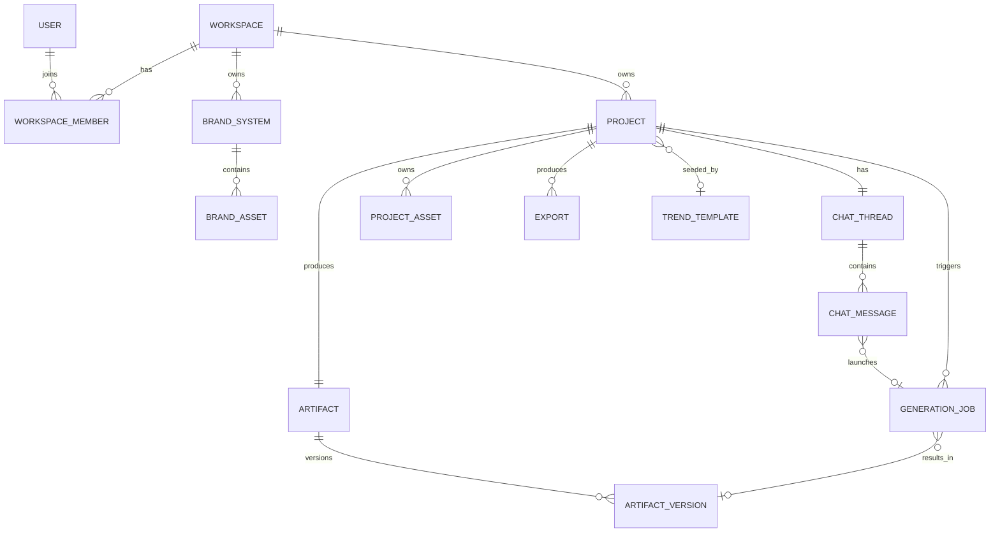

# Orra Core Domain Model and Data Architecture

Version 1.0
Scope: the foundational product objects, their relationships, storage, scoping, integrity, and versioning. No implementation code.
Source of truth: the Orra Project Source of Truth. Where this design departs from it, the departure is marked and argued.

---

## 0. The two decisions to make before reading the tables

Most of this document is mechanical once two questions are settled. Both came out of your object list rather than the source of truth, and both are worth a deliberate choice.

**Decision A: introduce the Workspace as the ownership anchor now.** The source of truth models everything as user-owned and never describes teams. You listed Workspace/organization as a core object, and that is correct, because tenancy is the single thing in a data model that cannot be retrofitted cheaply. The recommendation: every owned object (brand systems, projects, assets, artifacts, billing) belongs to a **workspace**, and a user joins workspaces through membership. In V1 a workspace is invisible: signing up auto-creates one personal workspace with one member, and no team UI exists. The cost of doing this now is one extra `workspace_id` column on a handful of tables and a membership join. The cost of not doing it is a full-data migration the day an agency wants a shared account, plus rewriting every authorization check. Pay the small cost now.

The one real consequence: **credits and subscription attach to the workspace, not the user.** A team shares a credit pool. This is the correct behavior for agencies and is only clean if the workspace exists from the start.

**Decision B: cards and layers are JSON inside a version snapshot, not normalized tables.** You listed Card and Layer as core objects, which tempts a `cards` table and a `layers` table. Do not build them. Cards and layers are always read, written, mutated, and versioned together as one unit (the Artifact Document), are never queried independently, and are tiny. Normalizing them buys nothing and costs a multi-row transactional reconstruction on every read and a multi-table copy on every version. They live as structured JSON inside `artifact_versions.document`. This is argued in full in sections 7 and 11.

Everything below assumes these two decisions.

---

## 1. Domain model explanation

Orra has one spine and three satellites.

The **spine** is the chain that turns conversation into an editable visual:

```
Workspace -> Project -> ChatThread -> ChatMessage -> GenerationJob -> ArtifactVersion -> Artifact
```

A user talks inside a project's thread. A creation request produces a generation job. The job, when it succeeds, writes a new artifact version, which is a full snapshot of the layered document. The artifact is the project's single evolving output; its history is the list of versions.

The **three satellites** hang off that spine:

- **Brand systems** (with their brand assets) are reusable, workspace-global context that generation jobs read from. They are not owned by any one project.
- **Project assets** are the bytes a single project owns: uploads, AI-generated backgrounds and objects, pinned brand-asset copies, and exports. They never leave their project.
- **Trend templates** are a platform-owned catalog of prompt examples. They seed new projects but are not owned by users and have no lasting link to what they create.

The central modeling truth, inherited from the product philosophy, is that **the Artifact Document is one object, not a tree of database rows.** A carousel is a document containing cards; a card contains ordered layers; a single post is a document with one card. The database stores documents, not their internals. The kernel (the only thing that mutates a document) operates on JSON, and a version is a copy of that JSON. Cards and layers are first-class *product* concepts and first-class *document* concepts, but they are deliberately not first-class *table* concepts.

A second modeling truth: **the conversation and the project are separated.** A project is a container with a brand, a ratio, assets, and an artifact. A thread is the ordered log of the conversation that produced it. In V1 there is exactly one thread per project, but keeping them distinct means the day you want to branch ("explore a different direction without losing this one") it is a new thread, not a schema migration.

---

## 2. Entity relationship diagram in text form

Relationships, parent to child, with cardinality and delete behavior:

```
Workspace 1───* WorkspaceMember *───1 User
Workspace 1───* BrandSystem
Workspace 1───* Project
Workspace 1───* (Subscription / CreditPool)        [billing scope, out of detailed scope here]

BrandSystem 1───* BrandAsset                         (logo, reference images)

Project 1───1 ChatThread                             (1:1 in V1; model allows 1:* later)
Project 1───* ProjectAsset                           (uploads, generated, pinned, exports)
Project 1───1 Artifact                               (one evolving output per project)
Project 0/1──* GenerationJob                         (jobs triggered within the project)
Project *───0/1 TrendTemplate                        (source_template_id, loose, SET NULL)

ChatThread 1───* ChatMessage                         (append-only, ordered)

ChatMessage 0/1──1 GenerationJob                     (message that launches/reports a job)

GenerationJob 0/1──1 ArtifactVersion                 (result_version_id on success)

Artifact 1───* ArtifactVersion                       (full document snapshots)
Artifact 1───1 ArtifactVersion                       (current_version_id pointer)

Project 1───* Export                                 (PNG or ZIP records)

TrendTemplate (global, no owner)
```

Same model as a Mermaid ER diagram:



---

## 3 and 4. Recommended tables and their important fields

Conventions: `id uuid pk`, `created_at`, `updated_at` on every table unless noted. Every owned table carries `workspace_id` so authorization and RLS key off one column.

### workspaces
The tenancy and billing boundary.
- `id`, `name`, `type` (`personal` | `team`), `plan` (`free`|`creator`|`pro`|`studio`), `owner_user_id`.

### users
App mirror of the Clerk identity.
- `id`, `clerk_id` (unique), `email`, `display_name`.
- Note: a user is not the owner of content. They access content through workspace membership.

### workspace_members
Join table; the access-control hinge.
- `id`, `workspace_id` fk, `user_id` fk, `role` (`owner`|`admin`|`member`), unique `(workspace_id, user_id)`.
- V1: one row per user, role `owner`, in their personal workspace.

### brand_systems
Reusable global context for a workspace.
- `id`, `workspace_id` fk, `name`, `description`.
- `tone_of_voice` text (free textarea, not chips), `visual_direction` text (free textarea), `rules` text.
- `palette` jsonb `[{hex, role}]`, `fonts` jsonb `[fontFamily]` (catalog names only).
- Logos and reference images are rows in `brand_assets`, not columns.

### brand_assets
- `id`, `brand_system_id` fk, `workspace_id` fk (denormalized for scoping), `kind` (`logo`|`reference`), `r2_key`, `width`, `height`.
- Integrity: a logo asset is immutable. AI may place or resize it, never alter its bytes.

### projects
A chat-like container that owns one artifact.
- `id`, `workspace_id` fk, `name`, `type` (`post`|`carousel`|`from_assets`).
- `ratio` jsonb `{name, w, h}`.
- `brand_system_id` fk nullable, `ON DELETE SET NULL` (live reference; see integrity rules).
- `source_template_id` fk nullable, `ON DELETE SET NULL` (attribution only).
- `autosave_state` jsonb.
- One artifact per project; either `current_artifact_id` here or `project_id` on `artifacts`. Recommend `project_id` on `artifacts` with a unique constraint.

### chat_threads
The conversation log, separated from the project container.
- `id`, `project_id` fk, `workspace_id` fk, `title` (optional).
- V1: exactly one per project. Schema permits more for future branching.

### chat_messages
Append-only, ordered.
- `id`, `thread_id` fk, `workspace_id` fk, `role` (`user`|`assistant`|`system`).
- `content` text.
- `kind` (`text`|`approval_summary`|`job_ref`).
- `job_id` fk nullable (the message that launched or reports a generation).
- `metadata` jsonb (approval summary payload, assumptions, plan reference).
- Ordering by `created_at` plus a tiebreak `seq` to keep stable order within a millisecond.

### project_assets
Project-scoped bytes. Never shared across projects.
- `id`, `project_id` fk, `workspace_id` fk.
- `kind` (`upload`|`generated_background`|`generated_object`|`pinned_brand`|`reference`|`export`).
- `r2_key`, `content_hash` (dedupe generated images), `width`, `height`, `source_prompt`.
- Immutable once registered. "Replacing" an asset creates a new row.

### artifacts
The project's single evolving output.
- `id`, `project_id` fk (unique), `workspace_id` fk.
- `current_version_id` fk nullable (points at the live version).

### artifact_versions
Immutable full snapshots of the layered document. This is where cards and layers live.
- `id`, `artifact_id` fk, `workspace_id` fk.
- `version` int, unique `(artifact_id, version)`, monotonically increasing.
- `document` jsonb (the entire ArtifactDocument: type, ratio, cards, layers, document version counter).
- `reason` (`generation`|`region_edit`|`manual_edit`|`restore`).
- `created_by` (`user`|`ai`).
- Optional `brand_context_snapshot` jsonb for reproducibility (see versioning section).

### generation_jobs
Async work that produces or refines the document. Bridges chat to artifact.
- `id`, `project_id` fk, `workspace_id` fk.
- `kind` (`full_generate`|`region_edit`).
- `status` (`queued`|`running`|`partial`|`succeeded`|`failed`).
- `idempotency_key` unique, `reserved_credits`, `captured_credits`.
- `plan` jsonb (internal plan snapshot), `error` jsonb.
- `result_version_id` fk nullable (the version it produced).

### exports
Produced files.
- `id`, `project_id` fk, `workspace_id` fk, `format` (`png`|`zip`), `r2_key`, `ratio` jsonb.
- Immutable records. Bytes stored in R2 so a past export re-downloads without re-rendering.

### trend_templates
Platform-owned catalog. No workspace, no user.
- `id`, `title`, `prompt`, `description`, `reference_r2_key`, `tags` text[], `active` bool.
- Read-only to users in V1.

---

## 5. Ownership and scoping rules

- **Workspace is the root of all ownership.** Brand systems, projects, assets, artifacts, versions, jobs, exports, and billing all carry `workspace_id`. There is no user-owned content; users reach content only through membership.
- **Authorization key.** Every authorization check is "does this user have a membership in the workspace that owns this row." One column (`workspace_id`) plus one join (`workspace_members`) answers it everywhere.
- **Brand systems are workspace-global.** Any project in the workspace can attach any of the workspace's brand systems. They are reusable context, not project property.
- **Project assets are project-local and never shared.** A project cannot read another project's assets, even within the same workspace. This is the source-of-truth rule "project assets do not carry into other projects automatically," enforced by scoping reads to `project_id`, not just `workspace_id`.
- **Trend templates are unscoped platform data.** Global read access, no ownership, no per-workspace rows in V1.
- **Billing and credits are workspace-scoped.** Direct consequence of decision A. A workspace has one plan and one credit pool shared by its members.

---

## 6. How project assets differ from brand assets

They differ on three axes: scope, reusability, and lifecycle.

| | Project asset | Brand asset |
| --- | --- | --- |
| Owned by | a single project | a brand system (workspace-global) |
| Reusable across projects | no | yes, via the brand system |
| Typical contents | uploads, generated backgrounds and objects, references, pinned copies, exports | logo, brand reference images |
| Mutability | immutable; replace by creating a new row | logo immutable; AI never alters it |
| Lifecycle | dies with the project | outlives any one project; deleting it must not break past artifacts |

The non-obvious rule that ties them together: **when an artifact uses a brand asset, the system pins a project-scoped copy** (`kind = pinned_brand`) and the document references that copy, not the live brand asset. This is required to honor the product rule that deleting a brand system keeps existing designs intact. Without pinning, deleting a brand logo would leave dangling references in every artifact that used it. With pinning, the brand asset is read-once at generation time, copied into the project, and the artifact is self-contained forever after.

---

## 7. How artifacts, cards, and layers are stored

One artifact per project. The artifact is a thin row that points at its current version and owns a history of versions. The visual content lives entirely inside `artifact_versions.document` as a single JSON structure:

```
ArtifactDocument (the JSON in document)
  schemaVersion        forward-migratable
  type                 post | carousel
  ratio                { name, w, h }
  version              optimistic-concurrency counter
  cards: [
    {
      id, index, baseColor,
      layers: [
        {
          id, type, z, x, y, w, h, rotation, opacity, locked, hidden,
          ...type-specific fields
        }
      ]
    }
  ]
```

- A **card** is an object in `cards`. A single post is a document with one card.
- A **layer** is an object in a card's `layers` array, ordered by `z`. Types: `background`, `image`, `object`, `logo`, `text`, `shape`, `overlay`.
- There is exactly **one text layer type**. No headline, body, or CTA subtypes. A text layer carries `content`, `fontFamily`, `fontSize`, `fontWeight`, `lineHeight`, `letterSpacing`, `color`, `align`, plus the common geometry. The AI may use text differently visually, but the model keeps every text object identical and fully editable. This is the source-of-truth rule and it is enforced by the document schema, not by convention.
- Image-bearing layers (`background`, `image`, `object`, `logo`) carry an `assetId` referencing a `project_assets` row. **Image bytes are never in the document.** The document is kilobytes.
- Logo layers carry `aiManaged: false`; the kernel forbids any action that changes their bytes.

Why JSON and not tables: cards and layers are always read, written, mutated, and versioned as one unit; they are never filtered, joined, or queried independently; and a version is by definition a snapshot of the whole. A normalized model would force reconstructing the document from many rows on every read, a multi-row transaction on every edit, and a multi-table copy on every version. JSON gives atomic reads, atomic versioning, and trivial snapshots, for documents that are tiny. The only thing you give up is server-side querying across layers ("find every text layer using font X"), which is not a V1 need and, if it ever becomes one, is solved by an analytics pipeline that flattens documents, not by normalizing the live store.

---

## 8. How chat messages connect to generation jobs and artifacts

The chain is explicit and traceable:

```
user ChatMessage (creation request)
   -> intent detected (generation)
   -> assistant ChatMessage (kind = approval_summary, holds plan in metadata)
   -> user approves
   -> GenerationJob created (linked to project), credits reserved, enqueued
   -> assistant ChatMessage (kind = job_ref, job_id set) shows progress
   -> job succeeds -> writes ArtifactVersion -> sets job.result_version_id
   -> Artifact.current_version_id advances
   -> client reloads document and renders
```

The linking columns:

- `chat_messages.job_id` ties the message that launched or reports a generation to its `generation_jobs` row.
- `generation_jobs.result_version_id` ties a successful job to the `artifact_versions` row it produced.
- `artifact_versions.artifact_id` ties the version to the project's artifact.

This gives a complete audit trail from any version back to the message and the plan that produced it: version, job, message, approval payload. Conversation-mode messages (brainstorming, questions) have no `job_id` and never touch the artifact. Only an approved generation creates a job, and only a succeeded job creates a version, so the artifact never enters a half-written state.

---

## 9. How a trend template opens a new project with a prefilled prompt

The relationship is intentionally loose. A trend template is a prompt starter, not a binding.

1. User browses `trend_templates` and taps "Use this prompt" on one.
2. The client creates a fresh project (the normal new-project flow: pick type, ratio, brand or none) and records `projects.source_template_id` for attribution and analytics only.
3. The template's `prompt` text is copied into the chat input as editable, unsent text. This prefill is ephemeral client state; nothing is persisted as a message yet, and no generation runs.
4. The user edits the prompt freely, optionally uploads assets, then sends. From there it is the ordinary chat-to-generation flow.

Two integrity points: editing the prompt or the template later has no effect on the project, because the prompt was copied, not referenced. And deleting the template later does not break the project, because `source_template_id` is `ON DELETE SET NULL` and carries no functional weight. The template seeds; it does not own.

---

## 10. Data integrity rules

- **Tenancy integrity.** Every owned row has a non-null `workspace_id`. Cross-workspace references are forbidden. Cross-project asset references are forbidden even within a workspace.
- **Brand-asset pinning.** An artifact document may only reference project-scoped assets. Any brand asset used in generation is copied into `project_assets` as `pinned_brand` first. This guarantees "deleting a brand keeps existing designs."
- **Logo immutability.** Logo brand assets and `logo` layers are never altered. The kernel rejects any byte-changing action on them.
- **One current version.** `artifacts.current_version_id` always points at an existing version of that artifact. Versions are immutable and append-only; `(artifact_id, version)` is unique and gap-free per artifact.
- **Append-only logs.** `chat_messages` and `credit_ledger` (in the billing layer) are never updated or deleted in place; corrections are new rows.
- **Job-to-result integrity.** A `succeeded` job has a non-null `result_version_id`. A `failed` job has none and has fully refunded its reservation. A reservation is never orphaned: it is captured, refunded, or held by a still-running job.
- **Optimistic concurrency.** The document's internal `version` counter guards manual edits. A write declares its base version; a stale write is rejected and the client refetches.
- **Font references are soft constraints.** Fonts come from the app catalog (config, not a DB table), so a `fontFamily` in a document cannot be a database foreign key. The kernel validates against the live catalog on write, and the catalog only deprecates fonts, never removes them, so old documents never dangle.
- **Asset immutability.** Project assets are immutable once registered; replacement creates a new row, which keeps every version that referenced the old asset valid.
- **Idempotency.** Generation jobs and payment webhooks carry idempotency keys so retries cannot double-act.

---

## 11. What should be normalized versus stored as JSON

The rule: **normalize what you query, filter, join on, or give an independent lifecycle. Use JSON for nested structures that are always read and written as a unit with their parent.**

Normalized (tables): workspaces, workspace_members, users, brand_systems, brand_assets, projects, chat_threads, chat_messages, project_assets, artifacts, artifact_versions, generation_jobs, exports, trend_templates. Each has identity, is filtered or joined, and has a lifecycle of its own.

JSON (embedded):
- The entire ArtifactDocument (cards, layers, every layer property) inside `artifact_versions.document`. Always read and versioned as one unit; never queried internally.
- `brand_systems.palette` and `brand_systems.fonts`. Small, ordered, read as a unit with the brand.
- `projects.ratio`. A small value object.
- `chat_messages.metadata` and `generation_jobs.plan`. Free-shape payloads tied to one row.

The borderline case is brand_assets. They are JSON-tempting (a list on the brand system) but earn a table because they have independent lifecycle (upload, delete), independent bytes in R2, and need scoping columns. Rows, not JSON.

---

## 12. What should be versioned

**Versioned: the ArtifactDocument, and only that.** Every meaningful change writes a new `artifact_versions` row holding a full snapshot. Triggers: generation, region edit, and any manual edit (text change, layer move, style change, card change). Snapshots, not diffs, because the documents are kilobytes and snapshots make restore trivial and bug-free. The expensive bytes are in R2, shared across versions by key, so snapshotting JSON does not duplicate images.

**Not versioned:**
- Chat messages. They are already an append-only, immutable, time-ordered log; that *is* their history.
- Project assets and exports. Immutable records; replacement means a new row.
- Brand systems. They are edited in place. For reproducibility, the better move than versioning the brand is to **snapshot the brand context onto the generation** that used it (`artifact_versions.brand_context_snapshot` or `generation_jobs.plan`), so you can always answer "what brand state produced this version" without carrying a full brand version history. This keeps brand editing simple while preserving the audit trail where it matters.

---

## 13. Risks and tradeoffs

**Workspace from day one (decision A).** Risk: looks like generic SaaS bloat for a single-user V1. Tradeoff accepted: a tiny amount of present complexity (one column, one join, billing on workspace) against avoiding a tenancy migration that would otherwise touch every table and every authorization check. This is the highest-leverage early decision; the asymmetry favors building it now.

**Document as JSON, not normalized cards/layers (decision B).** Risk: you cannot run relational queries across layers, and a malformed document is a single corrupt blob rather than a few bad rows. Mitigation: Zod-validate every document on write, carry `schemaVersion` for forward migration, and keep the kernel as the only writer. The query limitation is not a V1 need and is solved later by an analytics flattening job, not by normalizing the live store.

**Schema evolution of the document.** Risk: as the kernel and layer types evolve, old snapshots may not match new code. This is the real long-term hazard of the JSON approach. Mitigation: `schemaVersion` on every document, a forward-migration step that upgrades old documents on read, and a hard rule that the renderer must handle every shipped `schemaVersion`. Treat document schema changes with the same care as database migrations.

**Live brand reference plus asset pinning.** Risk: two slightly different notions of "uses the brand" (live reference for future generations, pinned copy for produced artifacts) can confuse implementers. Tradeoff: this duality is exactly what lets brand edits affect future work while leaving past work intact. Document it loudly so no one "optimizes" the pin away.

**One artifact per project.** Risk: a user who wants a genuinely different second design in the same conversation has no place for it; it becomes a version of the same artifact or forces a new project. Tradeoff accepted for V1 simplicity: it matches "a project behaves like a chat" with one evolving output. If multi-artifact projects are ever needed, `artifacts.project_id` already permits relaxing the uniqueness constraint without restructuring.

**Thread separated from project.** Risk: a 1:1 thread table is mild over-normalization for V1. Tradeoff: it cleanly isolates the conversation from the container and makes future branching a new row rather than a migration. Cheap insurance; keep it.

**Snapshot brand context instead of versioning brands.** Risk: brand context is captured per generation, so a brand edit is not retroactively visible in old artifacts' metadata unless you re-read. Tradeoff: this is the intended behavior and far simpler than maintaining full brand version chains.

**Append-only growth.** Risk: `artifact_versions` and `chat_messages` grow without bound on heavy projects. Mitigation: documents are tiny, so this is slow; add retention or compaction (keep every version for N days, then thin to milestones) only if it becomes a cost problem, not preemptively.

---

## Summary of departures from the source of truth

1. **Ownership moves from user to workspace.** Recommended, because tenancy is the one expensive-to-retrofit boundary. Billing follows to the workspace.
2. **Cards and layers are not tables.** They are JSON inside versioned snapshots, because they are always handled as a unit and never queried internally.
3. **Brand assets used in artifacts are pinned into project scope.** Required to make "deleting a brand keeps existing designs" actually true at the data layer.
4. **Brand context is snapshotted per generation rather than brands being versioned.** Preserves reproducibility without brand version chains.

Everything else follows the source of truth directly: a project behaves like a chat, projects start fresh, project assets stay local, brand systems are reusable, artifacts are layered, carousels are cards, posts are one card, text is always editable as a single layer type, and trend templates are editable prompt starters with no lasting ownership.
