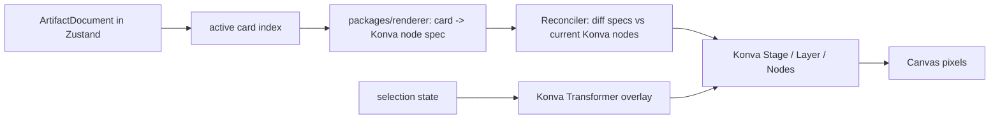
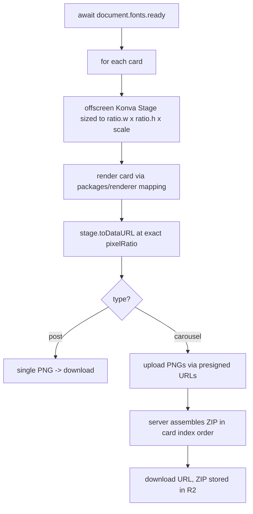

# Orra Rendering, Editing, and Export Subsystem

Version 1.0
Scope: the layered artifact schema, Konva renderer, selection and editing model, region selection for AI, autosave, undo/redo, version history, and export.
Builds on: the established Artifact Document model and kernel. This document makes those concrete for the client and goes deep on rendering and export.
No implementation code. TypeScript appears only as schema and signature design.

---

## 0. Stance: the canvas is a projection, not the model

Canva and Figma put the object model inside the canvas. You grab a rectangle and the canvas mutates its own internal state. That is the wrong shape for Orra, where chat and AI direction are primary and the editor is a secondary refinement surface.

Orra inverts it:

> The document is the single source of truth. Konva renders the document. Konva owns nothing. A drag, a resize, an inspector change, and an AI generation are all the same kind of event: an intent that becomes a kernel action, which mutates the document, which re-renders the canvas.

Consequences that fall out of this one decision and that the rest of the document depends on:

- Manual editing and AI editing share one write path (the kernel), so undo, validation, and versioning are uniform across both.
- The canvas can never hold state the document does not, so it cannot drift, cannot be the thing that corrupts an artifact, and can be thrown away and rebuilt from the document at any time.
- The same renderer that draws the preview draws the export, so what you see is what you ship.

Everything below is downstream of treating the canvas as a pure function of the document.

---

## 1. TypeScript schemas (deliverables 1, and system points 1 to 9)

These live in `packages/shared`, mirrored by Zod validators. The kernel validates every write against them. Geometry is in **logical pixels** in the card's canonical coordinate space (defined in section 2), not screen pixels and not normalized fractions.

### Artifact and card

```ts
type RatioName = '1:1' | '4:5' | '9:16' | '16:9' | 'custom';

interface Ratio {
  name: RatioName;
  w: number;   // canonical logical width  (e.g. 1080)
  h: number;   // canonical logical height (e.g. 1350 for 4:5)
}

interface ArtifactDocument {
  schemaVersion: number;   // for forward migration of stored documents
  artifactId: string;
  type: 'post' | 'carousel';
  ratio: Ratio;            // applies to all cards in the artifact
  cards: Card[];
  version: number;         // optimistic-concurrency counter, bumped per kernel apply
}

interface Card {
  id: string;
  index: number;           // display order, 0-based
  baseColor: string;       // solid fallback behind all layers (hex)
  layers: Layer[];         // stored in z order, low to high
}
```

### Base layer and the discriminated union

```ts
type LayerType =
  | 'background' | 'image' | 'object' | 'logo'
  | 'text' | 'shape' | 'overlay';

interface BaseLayer {
  id: string;
  type: LayerType;
  z: number;               // explicit z-index; array order kept in sync
  x: number; y: number;    // top-left in canonical logical px
  w: number; h: number;    // box size in canonical logical px
  rotation: number;        // degrees
  opacity: number;         // 0..1
  locked: boolean;         // cannot be selected-for-edit or moved
  hidden: boolean;         // not rendered, not exported
  anchor?: Anchor;         // reflow hint, see section 11
}

type Layer =
  | TextLayer | BackgroundLayer | ImageLayer
  | ObjectLayer | LogoLayer | ShapeLayer | OverlayLayer;
```

### Text layer (the only text type, system point 4)

```ts
interface TextLayer extends BaseLayer {
  type: 'text';
  content: string;
  fontFamily: string;      // MUST exist in the app font catalog
  fontSize: number;        // logical px
  fontWeight: number;      // 100..900
  lineHeight: number;      // multiplier of fontSize (e.g. 1.2)
  letterSpacing: number;   // logical px
  color: string;           // hex
  align: 'left' | 'center' | 'right';
  // w defines the wrap width; h is the measured/!min box height
}
```

There is one text type and only one. No headline, body, subtitle, or CTA subtypes. The AI may use text differently visually by setting different properties, but the model and inspector treat every text object identically and keep it fully editable. This is enforced by the schema: there is no other text shape to create.

### Image-backed layers (system points 5 to 8)

All four reference a `project_assets` row by `assetId` and share an image base, but they differ in constraints and semantics, so they are distinct types.

```ts
interface ImageBackedBase extends BaseLayer {
  assetId: string;                  // project-scoped asset (never a live brand asset)
  fit: 'cover' | 'contain' | 'fill';
  crop?: { x: number; y: number; w: number; h: number };
  sourcePrompt?: string;            // provenance, enables "regenerate"
}

interface BackgroundLayer extends ImageBackedBase {
  type: 'background';
  // the one solid, full-bleed image; conventionally z = 0; no alpha expected;
  // text is NEVER baked into this; the image model is told "no text"
}

interface ImageLayer extends ImageBackedBase {
  type: 'image';
  // user-placed photo or uploaded asset; may have alpha
}

interface ObjectLayer extends ImageBackedBase {
  type: 'object';
  // AI-generated transparent object from a region edit; alpha required;
  regionOrigin?: { x: number; y: number; w: number; h: number }; // where the user asked for it
}

interface LogoLayer extends ImageBackedBase {
  type: 'logo';
  aiManaged: false;        // literal false; the kernel forbids byte changes
  // references a pinned project copy of a brand logo; may be moved/scaled,
  // never recolored, cropped destructively, or regenerated
}
```

The distinction between `background`, `image`, `object`, and `logo` is not cosmetic. The kernel enforces different rules per type: backgrounds are full-bleed and singular per card by convention; objects always carry alpha and originate from region edits; logos are immutable in bytes. Collapsing them into one type would lose those guarantees.

### Shape and overlay layers (system point 9)

```ts
interface ShapeLayer extends BaseLayer {
  type: 'shape';
  shapeKind: 'rect' | 'ellipse' | 'line';
  fill?: string;                    // hex
  stroke?: { color: string; width: number };
  cornerRadius?: number;            // rect only
}

interface OverlayLayer extends BaseLayer {
  type: 'overlay';
  overlayKind: 'linearGradient' | 'radialGradient' | 'solid' | 'blur';
  params: {
    stops?: { offset: number; color: string }[];  // gradients
    angle?: number;                                // linear gradient
    blurRadius?: number;                           // blur
    color?: string;                                // solid scrim
  };
}
```

Overlays exist mainly to make text readable over busy backgrounds (a gradient scrim behind a headline), which connects directly to the readability checks in section 13.

---

## 2. Coordinate space and the canonical card size

This is foundational, so it comes before the renderer.

Every card has a **canonical logical size** equal to the artifact's `ratio.w` by `ratio.h` (for example 1080 by 1350 for 4:5). All layer geometry is stored in this logical space. The renderer scales logical space to whatever surface it draws on:

- **On screen**: the Konva Stage is scaled to fit the viewport. Logical (1080 wide) maps to however many CSS pixels the preview occupies. The document never changes when the window resizes; only the Stage scale does.
- **On export**: the renderer scales logical space to the exact target resolution, independent of the screen and independent of `devicePixelRatio`. This is what guarantees a deterministic export (section 12).

Storing logical pixels rather than normalized fractions is deliberate. Fractions seem ratio-friendly but break on text: a font does not scale linearly with width, line wrapping depends on absolute box width, and a circle becomes an ellipse under non-uniform scale. Logical pixels keep text and geometry honest, and ratio changes become an explicit, controllable operation (section 11) rather than a silent distortion.

---

## 3. Renderer architecture (deliverables 2 and 7, system point 10)

### The render flow



`packages/renderer` is a pure mapping: given a card and the catalog (fonts, asset URLs), it produces a description of Konva nodes (one node per visible layer, ordered by z). A thin reconciler diffs that description against the live Konva tree and applies the minimum changes. React does not render Konva nodes element-by-element on every keystroke; it owns the document and triggers reconciliation when the active card's content changes.

Why a reconciler rather than React-Konva component trees per layer: it keeps the renderer pure and shared with the export path, where there is no React. The same mapping runs in a headless context for export (section 12) and, later, in a server-side renderer. One mapping, two hosts.

### Rendering text cleanly (deliverable 7)

Konva renders text to a canvas, so text fidelity depends on getting four things right:

1. **Fonts must be loaded before drawing.** Self-host all catalog fonts, register them via the FontFace API, and gate any render or export on `document.fonts.ready`. If you draw before fonts load, text renders in a fallback face and then shifts, and export captures the wrong face. This gate is non-negotiable for export.
2. **Map every text property to Konva.** `content` to `text`, `fontFamily` to `fontFamily`, `fontSize`, `fontWeight` to the font-style/weight, `lineHeight` (Konva takes a multiplier), `letterSpacing`, `color` to `fill`, `align`, and `w` to the wrap `width` so wrapping is deterministic and matches export.
3. **Render at the right pixel ratio.** Draw at a pixel ratio that yields crisp text at the current Stage scale on screen, and at exactly the target resolution on export. Avoid fractional scales that blur glyph edges.
4. **Text is never baked into images.** The prompt enhancer instructs image models to produce no text, no watermark, no logo. The app draws all readable text as text layers on top. This is the core product rule and it is what keeps text editable.

Konva handles wrapping by width and basic alignment well. It does not do advanced typographic features (kerning pairs beyond the font, justified text, hyphenation). Those are out of scope for V1 and would be the first thing to flag if a design needs them.

---

## 4. State management architecture (deliverable 3)

Two state systems with a clear boundary, plus the pure kernel.

- **TanStack Query owns server truth.** Fetching the current artifact version, the version list, job status (polled), assets, brand context. Mutations (apply manual action, start generation, request export) go through it so the cache stays correct.
- **Zustand owns the live editing session.** The working `ArtifactDocument`, `activeCardId`, `selection` (layer ids), `canvasMode` (`select` or `region`), transient drag state, and the undo and redo stacks. None of this is the artifact; it is the session over the artifact.
- **The kernel is pure** (`packages/shared`), imported by Zustand actions and by the consumer. `applyAction(document, action) -> { document, inverse }`.

Lifecycle: on project open, TanStack Query fetches the current version; its `document` hydrates the Zustand working copy. Edits mutate the Zustand copy through the kernel and are autosaved via a TanStack mutation. A completed AI job invalidates the version query; the client adopts the new version into the working copy (section 10 governs how, so an in-progress manual edit is not silently lost).

Selection, canvas mode, and the undo stacks live only in Zustand and are never persisted, because they are ephemeral per-user session state, not part of the artifact. This matters for the collaboration seam (section 14): ephemeral state is exactly what becomes per-user presence later.

---

## 5. Selection, inspector, and direct manipulation (system points 11, 12, 13)

### Selection model

Selection is ephemeral UI state: a set of layer ids within the active card. It is never written to the document and never versioned. A Konva Transformer overlay attaches to the selected nodes to show handles. Rules: locked layers are not selectable for editing; hidden layers are not selectable; switching cards clears selection; multi-select is supported and drives a reduced inspector (only properties common to the selection).

### Inspector model

The inspector is contextual and secondary. It appears only when something is selected and shows controls for that layer type, consistent with chat being primary:

- **Text layer**: font, size, weight, color, alignment, line height, letter spacing, opacity, position.
- **Image, object, logo**: opacity, position, scale, rotation, replace or regenerate, delete. Logo hides recolor and destructive crop because those are forbidden.
- **Shape**: fill, stroke, corner radius, opacity, position.

Every inspector control emits a kernel action (`setTextStyle`, `updateLayerProps`, `replaceAsset`, `markRegenerate`). The inspector does not mutate Konva or the document directly.

### Direct manipulation and the gesture-commit pattern

This is the most important interaction detail. You must not dispatch a kernel action on every `mousemove` during a drag or resize. That would flood the document with versions, pollute undo, and stutter.

The pattern:

1. On gesture start (drag or transform), enter a transient mode. Let Konva move or resize the node locally for smooth visual feedback. The document is untouched.
2. On gesture end, read the final geometry from Konva and dispatch **one** kernel action (`updateLayerProps` with the final `x, y, w, h, rotation`).
3. The kernel applies it, the document updates, the canvas reconciles to the now-authoritative state, and the single action goes on the undo stack.

This gives smooth interaction, one undo entry per gesture, and a clean autosave trigger per committed change. The same pattern applies to continuous inspector controls like an opacity slider: preview transiently, commit one action on release.

---

## 6. Region selection for AI editing (system point 14)

Region selection is a distinct canvas mode (`canvasMode = 'region'`), not layer selection. The user draws a rectangle on the active card. That rectangle, in canonical logical coordinates, plus a text instruction, is the input to the region-edit job.

Flow:

1. User switches to region mode and draws a marquee. The marquee is transient UI state, not a layer, not in the document.
2. The region (logical coords) and the instruction (for example "add a dog here") start a region-edit generation job.
3. The pipeline (from the AI subsystem) analyzes the card's background and surrounding context, generates a transparent object matched to the scene, stores it as a project asset, and applies a single `addLayer` action creating an `ObjectLayer` at the region's coordinates with `regionOrigin` set.
4. The new version arrives; the object appears as a normal, editable, movable layer.

The region never crops or repaints the background. It only tells the AI where to place an additive object. This is the non-destructive V1 rule: scene-aware insertion, not inpainting. Requests that imply repainting the existing scene are steered by the Director toward background regeneration or an additive object, because the model has no destructive background edit in V1.

---

## 7. Autosave architecture (deliverables 4, system point 15)

Separate two things that are easy to conflate:

- **Autosave** persists the current working document so nothing is ever lost. Frequent, debounced, overwrites the latest working state.
- **Version snapshot** creates an immutable restore point. Less frequent, milestone-driven.

### Autosave behavior

Every committed kernel action (manual edit, gesture commit, inspector change, card change, asset placement) marks the working document dirty and schedules a debounced save (for example 800 ms idle, with a hard flush every few seconds and on blur or navigation). The save sends the working document with its base `version` for optimistic concurrency. Autosave writes the *working* state; it does not create a new entry in the version-history timeline for every keystroke.

Triggers from the source of truth all map to committed kernel actions and therefore to autosave: generation result, text edit, layer movement, style change, card change, AI revision, asset upload.

### Where versions get created

A new immutable `artifact_version` is written at milestones, not on every autosave:

- **Before every AI operation** (generation or region edit). This pre-AI snapshot is the safety net for "AI iteration can destroy good work."
- **After every successful AI operation** (the produced version).
- **On explicit user save** ("save a version").
- Optionally, a periodic checkpoint of the working document during long manual sessions.

So autosave guarantees durability of the working state, and versioning guarantees restorability to known-good points. They are complementary, not redundant.

---

## 8. Undo and redo (system point 16)

Undo and redo are fine-grained, in-session, and client-side. They are not the same as version history.

The kernel returns an inverse action for every applied action. Zustand holds an undo stack and a redo stack of these inverse and forward actions. Undo pops the undo stack, applies the inverse through the kernel, and pushes the forward action onto redo. Any new edit clears the redo stack. Each undo or redo is itself a committed change, so it triggers autosave.

Scope and boundaries:

- Undo and redo cover manual kernel actions within the current session. The stacks live in memory and are lost on reload; cross-session recovery is version history's job, not undo's. State this to users implicitly by making version history visible.
- AI operations are coarse, asynchronous, and produce server versions. They do not go on the fine-grained undo stack. Instead, an AI operation is reversible through version restore: restoring the pre-AI snapshot. The UI can surface this as a single "Undo generation" affordance that restores that snapshot, bridging the two mechanisms without putting a multi-second async job into the action-level undo stack.

---

## 9. Version history (deliverables 5, system point 17)

Versions are the immutable snapshots from the domain model: full document JSON, tiny, one row per version, labeled by `reason` (`generation`, `region_edit`, `manual_checkpoint`, `restore`) and `created_by` (`user` or `ai`).

- **Timeline UI** shows milestones, not every autosave, so the list stays meaningful. Generations, region edits, and explicit saves are the natural entries; pre-AI snapshots are paired with their generation.
- **Restore is restore-forward, never rewrite.** Restoring version N creates a new version (a copy of N's document) and points `current_version_id` at it. History is append-only; you never lose the versions that came after the one you restored. This is what makes restoring safe: it is itself an undoable, recorded act.
- **Snapshots, not diffs.** Documents are kilobytes (text and references, no image bytes), so full snapshots are simpler and have no diff-replay bugs. Image bytes live in R2 and are shared across versions by `assetId`.
- **Retention**: keep all versions in V1. If heavy projects ever make this a cost, thin old non-milestone checkpoints, keeping every generation and explicit save. Do not optimize this preemptively.

---

## 10. Avoiding artifact corruption during AI edits (deliverable 8)

This is where autosave, versioning, the kernel, and concurrency combine into a guarantee.

1. **AI never writes the canvas or the document directly.** It emits kernel actions, which are Zod-validated. Malformed AI output is rejected before it can touch the working document.
2. **Snapshot before the AI runs.** Every generation and region edit writes a pre-AI version first, so the prior good state is always restorable. If the user dislikes the AI result, restore is one action.
3. **AI produces a new version; it never overwrites in place.** Success creates a new version that becomes current. Failure leaves the working document and the latest good version untouched.
4. **Concurrency reconciliation.** An AI job is computed against base version N. If the user kept editing while it ran and the working document advanced past N, the AI result is presented as a new version to adopt or discard rather than silently replacing the user's newer manual edits. Optimistic concurrency on the `version` counter detects the conflict; the user, not a silent merge, resolves it.
5. **Schema and kernel invariants** protect specifics: logos cannot be altered, fonts must be in the catalog, locked layers reject mutation, z-order stays consistent.
6. **Partial AI failure is preserved.** A carousel where some cards generate is stored as a usable version with the failed cards flagged, never as a half-written overwrite of good work.

The throughline: there is no code path where AI output mutates the live artifact without first snapshotting, validating, and producing a separate version. Corruption is structurally prevented, not merely guarded against.

---

## 11. Aspect ratio changes (deliverable 9)

A ratio change is a layout problem, not a transform. Canva scales and clips, which produces broken designs. Orra treats it explicitly.

The model: changing ratio changes each card's canonical `w` and `h`. Layer geometry stored in logical pixels must be re-placed. Two policies, chosen by how different the new ratio is:

- **Compatible change (same orientation, minor delta)**: proportional remap using each layer's `anchor` hint. `anchor` records how a layer relates to the card edges (for example "centered", "top-left inset", "bottom band full-width"). The kernel remaps positions to preserve those relationships rather than naively scaling. Text boxes keep font size and re-wrap to the new width.
- **Major change (orientation flip, for example 9:16 to 16:9)**: a proportional remap cannot preserve a good design, so this becomes an **AI reflow action**. The current document plus the new ratio go to the visual planner, which returns a new set of layer positions (kernel actions) that re-compose the design for the new shape. This is an AI-native advantage: ratio adaptation is a re-planning step, not a stretch.

`setRatio` is a single kernel action that picks the policy, produces a new version (so the old ratio is restorable), and never silently distorts. The `anchor` field on `BaseLayer` is the lightweight metadata that makes both policies smarter than raw scaling.

---

## 12. Export architecture (deliverables 6, system points 18 to 20)

Locked decision: client renders to PNG with Konva, server assembles the ZIP. This subsystem owns the client render and the fidelity guarantees.

### Render strategy

Export does not screenshot the on-screen Stage. It uses a **dedicated offscreen render at exact target resolution**, so the result is independent of screen size and `devicePixelRatio`:



Key points:

- **Fonts gate.** Export waits for `document.fonts.ready`. No render starts before fonts resolve, or text exports in a fallback face.
- **Exact resolution.** The offscreen Stage is sized to the canonical logical size times an export scale (for example 2x of 1080 for crisp output), and `toDataURL` uses a fixed `pixelRatio`. Same renderer mapping as the preview, so preview and export match by construction.
- **Same renderer, no second code path.** `packages/renderer` runs in the offscreen context exactly as on screen.

### PNG export (single post)

One card, rendered offscreen at target resolution, produced as a PNG, downloaded directly. Optionally also uploaded to R2 as an `exports` record so it can be re-downloaded later.

### ZIP export (carousel)

Every card rendered offscreen to a PNG, named by index to preserve order (for example `01.png`, `02.png`). PNGs upload to R2 via presigned URLs so large bytes never proxy through a Worker. The server assembles the ZIP in card-index order, stores it in R2, and returns a download URL. No PDF, per the product rule.

Export is free of credit cost; it is rendering, not AI compute.

---

## 13. Safe margins and readability checks (system point 21)

Two advisory systems, surfaced as soft warnings before export, never silently blocking.

### Safe margins

Each ratio carries a safe-zone inset (a percentage margin where platform UI or cropping is likely to intrude, for example Instagram's reserved areas). The editor shows margin guides. A check flags text or logos that fall outside the safe zone. Guides are visual aids; they do not constrain placement.

### Readability checks

Run before export and optionally continuously:

- **Contrast.** For each text layer, sample the rendered background within the text bounding box (average luminance of the composited pixels beneath it) and estimate contrast against the text color using a WCAG-style ratio. Low contrast raises a warning and can suggest an overlay scrim (an `OverlayLayer` gradient), which is exactly why overlays exist.
- **Overflow.** Flag text whose measured height exceeds its box, or any layer extending past the card bounds.
- **Minimum size.** Flag font sizes below a legible threshold at the export resolution.
- **Occlusion.** Flag text sitting under a higher-z opaque layer.

These can run client-side by sampling the offscreen render, and a heavier version can run as part of the AI quality checker. All warnings are advisory so the user, or the AI, stays in control.

---

## 14. Supporting future collaboration without overbuilding (deliverable 10)

Do not build CRDTs, operational transform, presence, or locking now. The architecture already contains the one seam that makes them addable later without reworking schemas or the renderer:

- **Kernel actions are discrete, serializable commands.** They are the natural unit of real-time sync. A future collaboration layer relays an ordered action log; clients apply the same actions through the same kernel. The document and renderer do not change.
- **The `version` counter is the conflict basis.** Optimistic concurrency today becomes server-ordered action sequencing later.
- **Ephemeral session state (selection, cursor, canvas mode) is already separated from the document.** That is precisely what becomes per-user presence.
- **Single-writer today.** Manual edits use optimistic concurrency; AI edits reconcile against base version. Multi-writer later is "order the actions on the server and broadcast", not a rewrite.

The rule that keeps the door open is the same rule that runs the whole subsystem: every mutation goes through a kernel action, and nothing else mutates the document. Honor that and collaboration is an additive layer, not a refactor.

---

## 15. Risks and tradeoffs (deliverable 11)

**Konva text fidelity.** Canvas text lacks advanced typography (justified text, hyphenation, fine kerning). Tradeoff accepted for V1: social posts use display-style text where this rarely bites. Flag it if a design demands editorial typesetting; the fallback is SVG text or a richer text engine, which is a larger investment.

**Client-side export determinism.** The client controls the export bytes, and device variance is possible. Mitigations: self-hosted fonts, `fonts.ready` gate, fixed export pixel ratio, offscreen render at exact resolution. Residual risk: free-plan watermarking cannot be enforced client-side. If that is ever required, it forces a server-side renderer.

**Logical-pixel coordinates plus explicit reflow.** More work than naive normalized scaling, and major ratio changes need an AI call. Tradeoff: this is the difference between adapted designs and stretched ones, and it leans into Orra's AI-native nature rather than fighting it.

**Gesture-commit latency.** Committing on gesture end means the authoritative state lags the visual by one frame at release. Imperceptible in practice, and the payoff is clean undo and no document flooding.

**Snapshot versioning growth.** Append-only versions grow on heavy projects. Slow, because documents are tiny; address with checkpoint thinning only if it becomes real.

**Document schema evolution.** As layer types evolve, old stored documents must still render. `schemaVersion` plus a forward-migration step on read is mandatory, and the renderer must handle every shipped version. This is the long-term maintenance tax of the JSON-document approach.

**AI-vs-manual concurrency.** Presenting an AI result as adopt-or-discard when the user edited mid-job is correct but adds a UI state. Tradeoff accepted: silent merge would risk losing work, which violates the core "do not destroy good work" rule.

---

## 16. Implementation phases for this subsystem (deliverable 12)

Each phase has a gate that must pass before the next. These expand the rendering-related phases of the overall roadmap.

**R0. Schemas and kernel.** Define the schemas in section 1 with Zod validators and the full kernel action set as pure tested functions. Gate: every action and every invariant (logo immutability, font-catalog validity, locked-layer rejection, z-order consistency) has a passing test.

**R1. Read-only renderer.** `packages/renderer` mapping plus the reconciler; render a hand-written document into a scaled Konva Stage with the card rail. Gate: a multi-card document renders faithfully at multiple ratios and rescales on viewport resize without document change.

**R2. Selection and Transformer.** Selection state, Transformer overlay, multi-select, locked/hidden handling, card-switch clearing. Gate: selecting a layer shows handles; selecting across types shows the reduced inspector set.

**R3. Direct manipulation with gesture-commit.** Drag and resize with transient preview and single-action commit on gesture end. Gate: moving and resizing produce exactly one undo entry per gesture and re-render from the document.

**R4. Inspector and text editing.** Contextual inspector for the one text type and for image, object, logo, shape; clean text rendering with the fonts gate. Gate: every text property edits through a kernel action and renders correctly; fonts are loaded before first paint.

**R5. Undo, redo, autosave.** Undo and redo stacks over kernel inverses; debounced autosave of the working document with optimistic concurrency. Gate: undo and redo are correct across mixed edits; a reload restores the last autosaved state; a stale write is rejected and refetched.

**R6. Version history.** Milestone snapshots, pre-AI snapshots, timeline UI, restore-forward semantics. Gate: an AI operation is preceded by a pre-AI snapshot and is reversible by restore; restoring never loses later versions.

**R7. Export.** Offscreen exact-resolution render; single PNG; carousel PNGs uploaded and server-assembled into a ZIP in order; fonts gate enforced. Gate: exported PNG matches preview pixel-for-pixel within tolerance; carousel ZIP downloads with cards in order.

**R8. Region selection and AI-edit integration.** Region mode and marquee; wire to the region-edit job; place the returned object layer; adopt-or-discard concurrency handling. Gate: a region edit adds a scene-matched, editable object layer without altering the background, and a concurrent manual edit is not lost.

**R9. Aspect ratio and readability.** `setRatio` with compatible-remap and AI-reflow policies and `anchor` hints; safe-zone guides; contrast, overflow, size, and occlusion warnings. Gate: a compatible ratio change remaps sensibly, a major change triggers reflow, and readability warnings surface before export.

R0 through R4 deliver an editable, faithfully rendered artifact. R5 and R6 make it safe to iterate. R7 ships it. R8 and R9 connect it to AI editing and make it robust across formats. Each phase is a self-contained unit suitable for handing to an implementation agent with its own gate.

---

## Summary of challenged assumptions

1. **The canvas is a projection, not the model.** Unlike Canva and Figma, Konva owns nothing; every change is a kernel action on the document. This is what makes AI and manual edits one mechanism and makes corruption structurally impossible.
2. **Aspect ratio change is a layout operation, not a transform.** Stored logical pixels plus anchor hints plus AI reflow for major changes, rather than the stretch-and-clip that flat editors do.
3. **Autosave and version history are different systems.** Autosave guarantees durability of the working state; versioning guarantees restorability to milestones, with a mandatory pre-AI snapshot so iteration cannot destroy good work.
4. **Undo and AI reversal are different.** Fine-grained action-level undo for manual edits; coarse version-restore for AI operations, never an async job on the undo stack.
5. **Export uses a dedicated offscreen render at exact resolution**, not a screenshot of the screen Stage, which is what makes preview and export match deterministically.
6. **Collaboration is a future additive layer over kernel actions**, not something to build now; the command architecture is the seam, so nothing here needs to be rebuilt to add it.
