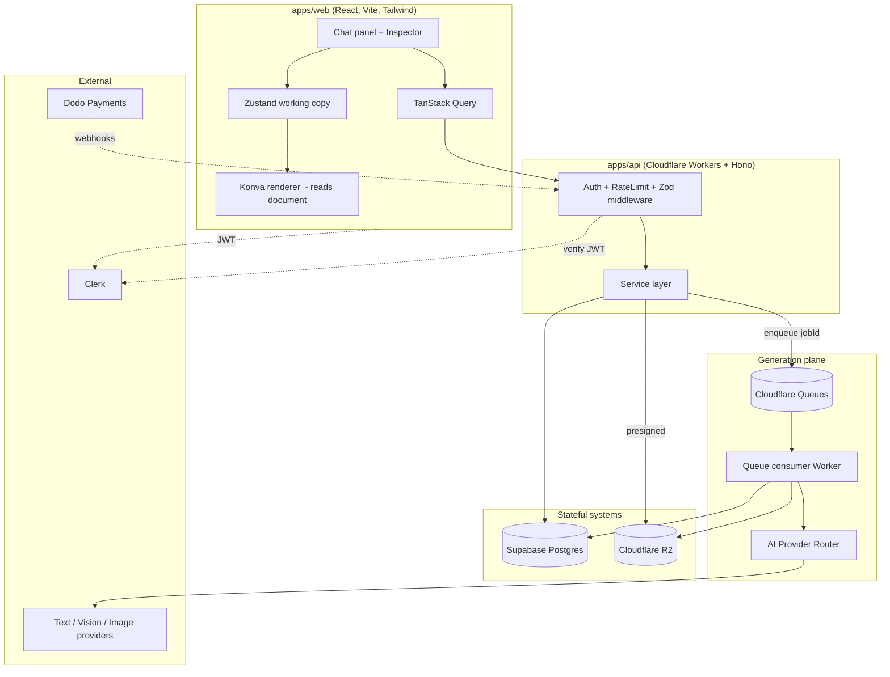
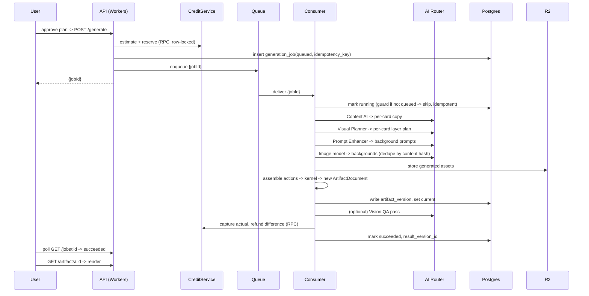

# Orra System Design

Version 1.0
Audience: an engineer who must be able to build the full platform from this document.
Scope: architecture, domain model, data, APIs, AI orchestration, jobs, credits, storage, security, scaling, failure handling, and a phased roadmap.

This document does not contain application code. Schema is given as data definition because it is a design artifact, not implementation.

---

## 0. How to read this

Orra is not a SaaS CRUD app with AI bolted on. The center of gravity is a single canonical data structure, the **Artifact Document**, and a single rule that everything else obeys:

> Nothing mutates the document except through kernel actions. The canvas renders the document. The AI proposes actions. The user approves. The kernel applies. Everyone reads the same truth.

If you understand the Artifact Document and the kernel, the rest of the system is plumbing around it: persistence, async AI, credits, and export. Read sections 4 and 7 first if you only read two.

---

## 1. Assumptions challenged and weaknesses to manage

The brief asked for a critical pass before the design. These are the decisions most likely to hurt, with the position taken.

### 1.1 Client-render plus server-assemble export is a fidelity and trust risk

The locked decision is: the client renders each card to PNG via Konva `toDataURL`, uploads the PNGs, and the server assembles the ZIP. This is correct for V1 because the client already has fonts loaded and the exact Konva instance that produced the preview, so what the user sees is what they get. There is no second renderer to keep in sync.

The risks are real and must be owned:

- **No headless regeneration.** The server cannot reproduce an export without a browser. A user who wants to re-download next month must reopen the project so the client can re-render, or download a previously stored export from R2.
- **Device variance.** A different device with a missing font or a different `devicePixelRatio` can produce a slightly different PNG. Mitigation: bundle and self-host all app fonts, force a fixed render `pixelRatio` keyed to the export ratio rather than the screen, and block export until `document.fonts.ready` resolves.
- **Trust.** The client controls the bytes. For a content tool this is acceptable. If watermarking on the free plan is ever required, watermarking must happen server-side or it can be stripped.

Path forward, not built in V1: a server-side renderer (Cloudflare Container running a headless browser with the same `packages/renderer`) becomes the source of truth for export when fidelity or watermarking demands it. The kernel and document model are designed so the same renderer code runs in both places, which keeps that door open at near-zero cost now.

### 1.2 "AI generates objects, app renders text" forbids true inpainting in V1

Region editing in V1 is **non-destructive**: the AI generates a transparent object on a new layer and places it over the background. It never repaints background pixels. This is the right call. It keeps the document editable, keeps the background as a single solid asset, and avoids the cost and unpredictability of inpainting pipelines.

The limitation to state plainly: requests that require changing the existing scene ("remove the car", "make it night", "fix this person's hand") are out of scope in V1, because they need destructive background edits. The product copy and the Director AI must steer these toward either a full background regeneration or an additive object. This is a feature boundary, not a bug, but it will generate user requests the system cannot honor, so the Director AI needs a graceful "I can add to the scene but not repaint it" response.

### 1.3 Intent misclassification is contained by the approval gate

Chat has two modes, conversation and generation. A naive worry is that misdetecting intent wastes credits. It does not, because **generation never spends credits before the approval card is accepted**. The worst case of a false positive is an unwanted approval card, which the user dismisses. The worst case of a false negative is the user repeating themselves. Both are cheap. This means intent detection can be a fast, cheap model and does not need to be perfect. Do not over-engineer it.

### 1.4 Variable-cost jobs break naive credit holds

A full carousel generation has an unknown cost at submit time: N cards, each possibly needing a background generation and zero or more objects, plus text model calls. You cannot charge a fixed price up front honestly, and you cannot charge after the fact safely.

Resolution, expanded in section 9: reserve the **estimated maximum** cost at submit, run the job, **capture the actual** cost on success, and **refund the difference**. On failure or partial failure, capture only for work delivered and refund the rest. The ledger, not a single integer balance, is what makes this safe under retries and races.

### 1.5 Cloudflare Workers cannot host long AI calls in the request path

FLUX background generation can take tens of seconds. Workers have request and CPU limits that make synchronous image generation in an HTTP handler fragile. Therefore the request that starts generation does almost nothing: validate, reserve credits, create a job row, enqueue a message, return a `jobId`. All AI calls happen in a Queue consumer. The client polls the job. This is not optional, it is forced by the runtime, and the whole pipeline is shaped around it.

### 1.6 Workers to Supabase is a cross-network hop on every request

Each Worker invocation talks to Postgres over the network, and Postgres connection limits do not love serverless fan-out. Use **Supabase's transaction pooler** (and Cloudflare **Hyperdrive** for pooling and edge caching of connections) rather than direct connections. Treat the database as the first scaling bottleneck, not the Workers.

### 1.7 Clerk owns identity, Supabase owns data, and RLS needs to know who the user is

Two systems hold pieces of auth. The decision (locked) is **service-layer authorization as primary, RLS as defense-in-depth**. Practically: the API verifies the Clerk JWT, resolves the internal `user_id`, and every service method checks ownership before touching data, using a privileged connection. RLS policies exist as a second wall in case a service method forgets a check or a future direct-DB path appears. Do not rely on RLS as the only gate, and do not skip it because the service layer exists. Both, on purpose.

### 1.8 Versioning storage is cheap here, so snapshot, do not diff

A reflex is to store version diffs to save space. Resist it. The Artifact Document is small: text, layer geometry, style, and **references** to image assets in R2, never image bytes. A full carousel document is kilobytes. Store full JSON snapshots per version. Simpler restore, simpler reasoning, no diff-replay bugs. The expensive bytes live in R2 and are shared across versions by key.

### 1.9 Concurrency is rare but must not corrupt the document

Single user, but multiple tabs and a generation job completing while the user hand-edits are both possible. Use **optimistic concurrency**: every document carries a monotonically increasing `version`. Writes declare the base version they were computed against. A stale write is rejected with `409`, and the client refetches and reapplies. No locks held across user think-time.

---

## 2. High-level architecture



Two planes:

- **Synchronous plane** (Workers + Hono): everything fast and transactional. Auth, CRUD, applying manual kernel actions, reserving credits, enqueuing jobs, issuing presigned URLs, assembling export ZIPs.
- **Asynchronous plane** (Queues + consumer): everything slow and AI-bound. Generation, region edits, quality checks. Talks to the same Postgres and R2, never to the client directly. The client learns results by polling the job row.

The client is a thin director and renderer. It never calls AI providers and never holds business authority. The document on the server is the truth; the Zustand copy is a working draft.

### Monorepo layout

```
apps/web         React app: chat, workspace, Konva renderer host, inspector
apps/api         Hono on Workers: routes, middleware, services
apps/consumer     Queue consumer Worker: generation + region-edit pipelines
packages/shared  Zod schemas, types, kernel actions, error taxonomy
packages/renderer Pure document -> Konva node mapping (runs in web today, container later)
packages/ai      Provider router, provider adapters, prompt builders
packages/db      Schema types, query helpers, RPC wrappers
packages/ui      Design-system primitives (calm blue-gray palette)
```

`packages/shared` holding the kernel and Zod schemas is what lets the client apply actions optimistically and the consumer apply them authoritatively from the same code. That shared kernel is the spine of the system.

---

## 3. Service architecture

Routes are thin. Each route verifies auth via middleware, parses input with Zod, calls one service method, maps domain errors to HTTP. **All authorization lives in services**, not routes, so it cannot be skipped by adding a new route.

| Service | Responsibility | Notable methods |
| --- | --- | --- |
| `ProjectService` | Project lifecycle, ownership | create, get, list, rename, duplicate, delete |
| `ArtifactService` | Document read, apply manual kernel action, versions | getCurrent, applyAction, listVersions, restoreVersion |
| `ChatService` | Message persistence, intent routing | append, listForProject, classifyIntent |
| `GenerationService` | Estimate cost, reserve, enqueue, status | estimate, start, getJob, retry |
| `RegionEditService` | Region edit job orchestration | start, getJob |
| `BrandService` | Brand systems and brand assets | crud, attachToProject, duplicate |
| `AssetService` | Project asset registration, presigned URLs | requestUpload, register, list, delete |
| `ExportService` | Receive rendered PNGs, assemble ZIP, record export | requestExport, assembleZip, getDownload |
| `CreditService` | Ledger operations, balance, estimates | balance, reserve, capture, refund, grantMonthly, topup |
| `BillingService` | Dodo checkout, subscription state, webhook apply | createCheckout, applyWebhook, getPlan |
| `TemplateService` | Trend template catalog (read mostly) | list, get |
| `FontService` | App font library catalog | list |

Service rules:

- A service method receives the resolved `userId` and performs an ownership assertion before any read or write that touches user data.
- Credit-affecting paths (`GenerationService`, `RegionEditService`) call `CreditService` inside the same logical transaction boundary as job creation, so a reserved credit always has a job and vice versa.
- Services never call AI providers directly. Only the consumer does. The synchronous plane reserves and enqueues; the asynchronous plane spends and produces.

---

## 4. Core entities and the domain model

### 4.1 Conceptual entities

- **User**: app-side mirror of a Clerk identity. Owns everything.
- **BrandSystem**: reusable, global per user. Provides AI context. Owns BrandAssets.
- **Project**: a chat-like container. Has a type (single post, carousel, from-assets), a ratio, an optional attached BrandSystem, chat messages, project assets, and exactly one current Artifact.
- **ProjectAsset**: uploaded or generated bytes scoped to one project.
- **ChatMessage**: a turn in the project conversation. May carry an attached approval summary or a job reference.
- **Artifact**: the generated visual output for a project. Points at a current ArtifactVersion.
- **ArtifactVersion**: an immutable snapshot of the Artifact Document JSON plus metadata (who, when, why).
- **GenerationJob / RegionEditJob**: async work units with status and cost.
- **CreditLedgerEntry**: append-only credit movement.
- **Subscription**: Dodo-backed plan state.
- **Purchase**: a credit-pack purchase.
- **TrendTemplate**: curated prompt example with a reference image.
- **Export**: a produced PNG or ZIP record.

### 4.2 The Artifact Document (the heart of the system)

The document is the single source of truth for one artifact. It is the only thing the renderer reads, the only thing the kernel writes, the only thing a version snapshots, and the only thing export consumes.

Shape, expressed as a Zod-validated schema in `packages/shared`:

```
ArtifactDocument
  schemaVersion: int                # migrate forward, never break old versions
  artifactId: uuid
  type: "post" | "carousel"
  ratio: { name: "1:1"|"4:5"|"9:16"|"16:9"|"custom", w: int, h: int }
  cards: Card[]                      # a post is a single card internally
  version: int                       # optimistic concurrency counter

Card
  id: uuid
  index: int                         # display order, 0-based
  baseColor: hex                     # solid fallback behind layers
  layers: Layer[]                    # ordered low z to high z

Layer  (discriminated union on `type`)
  common:
    id: uuid
    type: "background"|"image"|"object"|"logo"|"text"|"shape"|"overlay"
    z: int
    x, y, w, h: number               # in document coordinate space
    rotation: number
    opacity: 0..1
    locked: bool
    hidden: bool
  background | image | object | logo:
    assetId: uuid                    # R2-backed ProjectAsset
    fit: "cover"|"contain"|"fill"
    crop?: { x, y, w, h }
    sourcePrompt?: string            # provenance for regenerate
    aiManaged: bool                  # logos are aiManaged=false, never altered
  text:                              # the ONE text layer type
    content: string
    fontFamily: string               # must exist in FontService catalog
    fontSize: number
    fontWeight: number
    lineHeight: number
    letterSpacing: number
    color: hex
    align: "left"|"center"|"right"
  shape:
    shapeKind: "rect"|"ellipse"|"line"
    fill?: hex
    stroke?: { color: hex, width: number }
  overlay:
    overlayKind: "gradient"|"solid"|"blur"
    params: object
```

Design commitments encoded here:

- **One text layer type.** No headline/body/CTA subtypes. The AI may use text differently visually, but the model keeps every text object identical and fully editable. This is from the product spec and it simplifies the inspector, the kernel, and the renderer.
- **Backgrounds are the only solid image, generally.** Backgrounds, scene images, and AI objects reference R2 assets. Text is never baked into them.
- **Logos are `aiManaged: false`.** The kernel forbids any action that mutates a logo layer's `assetId` or pixels. It may move, scale, and set opacity. This enforces "AI must never modify brand logos" at the model and kernel level, not just by convention.

### 4.3 The kernel: the only writer

The kernel is a set of pure functions in `packages/shared`:

```
applyAction(document, action) -> { document', undoAction }
```

Action set (the complete vocabulary of change in Orra):

- Card: `addCard`, `removeCard`, `duplicateCard`, `reorderCards`, `setCardBase`
- Layer: `addLayer`, `removeLayer`, `updateLayerProps`, `reorderLayers`
- Text: `setTextContent`, `setTextStyle`
- Asset: `replaceAsset`, `markRegenerate`
- Document: `setRatio`

Every action is Zod-validated. Every successful apply increments `document.version` and returns an inverse action for undo. Invalid actions (e.g. mutating a logo's pixels, referencing a font outside the catalog, moving a locked layer) are rejected before mutation.

Two callers, one kernel:

- **Manual edit (synchronous):** client applies the action to its Zustand copy optimistically, then `POST`s the action with the base version. `ArtifactService.applyAction` re-validates and re-applies server-side, writes a new version, and returns the new version number. On version mismatch the server returns `409` and the client refetches.
- **AI edit (asynchronous):** the consumer computes a list of actions (a full generation produces an `addCard`/`addLayer` sequence; a region edit produces one `addLayer`), applies them server-side to produce the new document, writes a version, and the client picks it up by polling and reloads.

Because both paths share the kernel, undo/redo, validation, and versioning are uniform. The AI does not get a privileged side door into the canvas. It speaks the same action vocabulary as a user dragging a layer.

---

## 5. Database schema

Postgres on Supabase. UUID primary keys. `created_at`/`updated_at` on all tables. Money and credits are integers (credits are whole units). All user-owned tables carry `user_id` for RLS.

```sql
-- Identity (mirror of Clerk)
users (
  id                uuid pk,
  clerk_id          text unique not null,
  email             text,
  plan              text not null default 'free',   -- free|creator|pro|studio
  created_at, updated_at
)

-- Brand systems (global, reusable)
brand_systems (
  id                uuid pk,
  user_id           uuid fk -> users,
  name              text not null,
  description       text,
  tone_of_voice     text,           -- free textarea, not chips
  visual_direction  text,           -- free textarea
  palette           jsonb,          -- [{hex, role}]
  fonts             jsonb,          -- [fontFamily] from app catalog only
  rules             text,
  created_at, updated_at
)
brand_assets (
  id                uuid pk,
  brand_system_id   uuid fk -> brand_systems,
  user_id           uuid fk -> users,
  kind              text not null,  -- logo|reference
  r2_key            text not null,
  width, height     int,
  created_at
)

-- Projects (chat-like containers)
projects (
  id                uuid pk,
  user_id           uuid fk -> users,
  name              text not null,
  type              text not null,  -- post|carousel|from_assets
  ratio             jsonb not null, -- {name,w,h}
  brand_system_id   uuid fk -> brand_systems null,  -- snapshot OR live ref; see note
  current_artifact_id uuid null,
  autosave_state    jsonb,
  created_at, updated_at
)
project_assets (
  id                uuid pk,
  project_id        uuid fk -> projects,
  user_id           uuid fk -> users,
  kind              text not null,  -- upload|generated_background|generated_object|reference|export
  r2_key            text not null,
  content_hash      text,           -- for dedupe of generated images
  width, height     int,
  source_prompt     text,
  created_at
)

-- Chat
chat_messages (
  id                uuid pk,
  project_id        uuid fk -> projects,
  user_id           uuid fk -> users,
  role              text not null,  -- user|assistant|system
  content           text,
  kind              text not null default 'text', -- text|approval_summary|job_ref
  metadata          jsonb,          -- approval payload or {jobId}
  created_at
)

-- Artifacts + versions (snapshot, do not diff)
artifacts (
  id                uuid pk,
  project_id        uuid fk -> projects,
  user_id           uuid fk -> users,
  current_version_id uuid null,
  created_at, updated_at
)
artifact_versions (
  id                uuid pk,
  artifact_id       uuid fk -> artifacts,
  user_id           uuid fk -> users,
  version           int not null,   -- monotonically increasing per artifact
  document          jsonb not null, -- full ArtifactDocument
  reason            text,           -- manual_edit|generation|region_edit|restore
  created_by        text,           -- user|ai
  created_at,
  unique (artifact_id, version)
)

-- Async jobs
generation_jobs (
  id                uuid pk,
  project_id        uuid fk -> projects,
  user_id           uuid fk -> users,
  kind              text not null,  -- full_generate|region_edit
  status            text not null,  -- queued|running|partial|succeeded|failed
  idempotency_key   text unique,
  reserved_credits  int not null,
  captured_credits  int not null default 0,
  plan              jsonb,          -- internal plan snapshot
  error             jsonb null,
  result_version_id uuid null,
  created_at, updated_at
)

-- Credits (ledger is the source of truth)
credit_ledger (
  id                uuid pk,
  user_id           uuid fk -> users,
  entry_type        text not null,  -- grant|reserve|capture|refund|expire|topup
  bucket            text not null,  -- subscription|topup
  amount            int not null,   -- signed: grants/topups +, reserves/captures -
  job_id            uuid null,
  expires_at        timestamptz null,  -- set for subscription grants
  created_at
)
-- balance is a query over non-expired entries; optionally cached:
credit_balances (
  user_id           uuid pk fk -> users,
  subscription_avail int not null default 0,
  topup_avail        int not null default 0,
  reserved           int not null default 0,
  updated_at
)

-- Billing
subscriptions (
  id                uuid pk,
  user_id           uuid fk -> users,
  dodo_subscription_id text unique,
  plan              text not null,  -- creator|pro|studio
  status            text not null,  -- active|past_due|canceled
  current_period_end timestamptz,
  created_at, updated_at
)
purchases (
  id                uuid pk,
  user_id           uuid fk -> users,
  dodo_payment_id   text unique,
  pack              text not null,  -- pack_5|pack_10|pack_25|pack_50
  credits_granted   int not null,
  status            text not null,  -- pending|paid|failed
  created_at
)
webhook_events (             -- idempotency for Dodo
  id                uuid pk,
  provider          text not null,
  event_id          text unique not null,
  processed_at      timestamptz null,
  payload           jsonb,
  created_at
)

-- Catalog (global, read-mostly)
trend_templates (
  id                uuid pk,
  title             text not null,
  prompt            text not null,
  description       text,
  reference_r2_key  text not null,
  tags              text[],
  active            bool default true,
  created_at
)
exports (
  id                uuid pk,
  project_id        uuid fk -> projects,
  user_id           uuid fk -> users,
  format            text not null,  -- png|zip
  r2_key            text not null,
  ratio             jsonb,
  created_at
)
```

Index notes:

- `chat_messages(project_id, created_at)`, `artifact_versions(artifact_id, version)`, `project_assets(project_id)`, `generation_jobs(user_id, status)`, `credit_ledger(user_id, created_at)`, `credit_ledger(user_id, bucket) where expires_at is null or expires_at > now()`.
- `projects(user_id, updated_at desc)` powers the Recent tab.
- `webhook_events(event_id)` unique enforces idempotent webhook processing.

Brand reference note: `projects.brand_system_id` is a live reference, matching the product rule that deleting a brand system keeps existing designs but stops future generations from using it. Past versions already baked the brand context into their documents and assets, so they are unaffected. Future generations resolve the brand at generation time and simply find nothing if it was deleted.

---

## 6. API architecture

Hono on Workers. JSON over HTTPS. JWT in `Authorization`. Zod at the boundary. Errors use a stable taxonomy (`UNAUTHENTICATED`, `FORBIDDEN`, `NOT_FOUND`, `VERSION_CONFLICT`, `INSUFFICIENT_CREDITS`, `VALIDATION`, `PROVIDER_FAILURE`, `RATE_LIMITED`).

Route map:

```
# Projects
POST   /projects                         create
GET    /projects                         list (tab=recent|all)
GET    /projects/:id                     get
PATCH  /projects/:id                     rename / set ratio / attach brand
POST   /projects/:id/duplicate           duplicate
DELETE /projects/:id                     delete (cascades assets, versions, exports)

# Chat
GET    /projects/:id/messages            list
POST   /projects/:id/messages            append user message -> returns intent + (conversation reply | approval summary)

# Artifact + kernel
GET    /artifacts/:id                     current document
POST   /artifacts/:id/actions             apply manual kernel action {action, baseVersion} -> {version} | 409
GET    /artifacts/:id/versions            list versions
POST   /artifacts/:id/restore             restore {version}

# Generation (async)
POST   /generate                          {projectId, approvedPlan} -> reserve + enqueue -> {jobId}
GET    /jobs/:id                          status + result_version_id when done
POST   /jobs/:id/retry                    re-enqueue failed job (re-reserve if refunded)
POST   /region-edit                       {artifactId, cardId, region, instruction} -> {jobId}

# Brand
POST   /brand-systems                     create
GET    /brand-systems                     list
GET    /brand-systems/:id                 get
PATCH  /brand-systems/:id                 update
POST   /brand-systems/:id/duplicate       duplicate
DELETE /brand-systems/:id                 delete

# Assets
POST   /assets/upload-url                 {projectId, contentType} -> presigned PUT + assetId
POST   /assets/register                   confirm upload {assetId, width, height}
GET    /projects/:id/assets               list
DELETE /assets/:id                         delete

# Export
POST   /export                            {projectId, format} -> {uploadUrls[]} for client PNGs
POST   /export/:id/assemble               client confirms PNGs uploaded -> server zips -> {downloadUrl}
GET    /export/:id                         get download url

# Credits + billing
GET    /credits                           {subscriptionAvail, topupAvail, reserved, resetDate}
GET    /credits/ledger                    paginated history
POST   /billing/checkout                  {plan|pack} -> Dodo checkout url
POST   /webhooks/dodo                      signature-verified, idempotent

# Catalog
GET    /trend-templates                   list
GET    /fonts                             app font catalog
```

Two endpoints carry the most subtlety:

- `POST /artifacts/:id/actions` is the manual-edit write path. It is the only synchronous mutation of a document. It enforces optimistic concurrency and runs the same kernel the client just ran, so the server validates rather than trusts.
- `POST /generate` does no AI work. It estimates cost, reserves credits, writes a `generation_jobs` row with an idempotency key, enqueues, and returns immediately.

---

## 7. AI workflow architecture

### 7.1 Provider router (built day one, not retrofitted)

`packages/ai` exposes capability-typed interfaces, never a concrete provider, to the rest of the system:

```
TextModel.complete(messages, opts)        -> text
VisionModel.analyze(image, prompt, opts)  -> structured description
ImageModel.generate(prompt, opts)         -> image bytes (opaque)
ImageModel.generateTransparent(prompt, opts) -> image bytes (alpha)
```

Each capability has a **router** with: a cheap default, a premium option, an ordered fallback list, per-call timeouts, bounded retries with jittered backoff, and cost accounting. Adapters wrap concrete providers and normalize their request and response shapes.

V1 mapping (kept deliberately small):

| Capability | Default | Premium / fallback |
| --- | --- | --- |
| Text (director, copy, planner, prompt-enhancer) | Gemini 2.5 Flash Lite | GPT-5 nano (fallback) |
| Vision (image understanding, region analysis, QA) | Gemini 2.5 Flash Lite | same |
| Image (backgrounds) | FLUX Schnell | Gemini 2.5 Flash Image (fallback) |
| Image edit / transparent object | FLUX Kontext Pro | Gemini 2.5 Flash Image |

The four "text AI roles" (Director, Content, Visual Planner, Prompt Enhancer) are the **same model with different system prompts** in V1. They are separate roles in the architecture so they can split onto different models later without touching callers. Provider choice is config, never a hardcoded import.

Every router call records `{capability, provider, tokens_or_units, latency, cost}` for cost dashboards and for the credit estimator's calibration.

### 7.2 Intent detection and approval (synchronous)

On `POST /projects/:id/messages`, the Director runs a fast classification: conversation or generation.

- **Conversation**: reply inline, persist assistant message, done. No plan, no card, no credits.
- **Generation**: produce an internal plan (card sequence, copy direction, visual direction, brand usage, ratio, CTA state, per-card image prompts) and return a **lightweight approval summary** (style, format, brand, CTA state, action buttons). The full plan is persisted on the message metadata and never shown raw. The user approves, edits direction, adds a missing critical field, or cancels. Only on approve does `POST /generate` fire.

The Director asks a clarifying question only when a detail is blocking: "use my brand" with no brand attached, "use the uploaded image" with no upload, a required CTA missing, or an uninterpretable request. Otherwise it uses smart defaults and surfaces them as assumptions in the summary.

### 7.3 Full generation pipeline (asynchronous)



Key properties: text never enters the image. The image model produces backgrounds and scene visuals with empty space and explicit "no text, no watermark, no logo unless requested" constraints from the Prompt Enhancer. The app renders all readable text as text layers. Identical background prompts are deduped by content hash so a retry or a similar card reuses bytes.

### 7.4 Region edit pipeline (asynchronous, non-destructive)

1. User selects a region on a card and says "add a dog here".
2. Vision model analyzes the card background plus the region context and returns scene properties: lighting, perspective, scale cue, palette, mood, style.
3. Prompt Enhancer builds a transparent-object prompt conditioned on those scene properties so the object matches the scene rather than looking pasted.
4. `ImageModel.generateTransparent` produces an alpha PNG.
5. The object is stored in R2 and added as a new `object` layer at the region's coordinates via a single `addLayer` kernel action.
6. New version written, credits captured, job marked done, client reloads.

No background pixels change. The result is an editable, movable, deletable object layer, consistent with the V1 non-destructive rule from section 1.2.

---

## 8. Job processing architecture

- **Producer**: the API enqueues a minimal message, `{jobId}`. All state lives in the `generation_jobs` row, not the message, so messages stay small and replayable.
- **Consumer**: a dedicated Worker (`apps/consumer`) bound to the queue. On delivery it transitions the job `queued -> running` with a guard: if the job is not `queued`, it is a duplicate delivery and is acked without work. This makes the consumer idempotent against Cloudflare's at-least-once delivery.
- **Retries**: transient failures (provider timeout, 5xx) throw and let the queue redeliver with backoff, up to a max. Each redelivery re-checks the guard. After max attempts the message lands in a **dead-letter queue**; a DLQ handler marks the job `failed` and triggers a full refund.
- **Concurrency control**: per-user in-flight job cap (enforced at `POST /generate`, e.g. reject a new job if the user already has K running) so one user cannot saturate the consumer or the provider rate limits.
- **Partial success**: a carousel where 4 of 5 cards generate and one image provider call exhausts fallbacks is marked `partial`. The successful cards are persisted as a usable version; the failed card is flagged; credits are captured only for delivered work and the rest refunded. The user can retry just the failed card.

---

## 9. Credit architecture

The ledger, not a counter, is the source of truth. A balance is a query; the cache table is an optimization.

### 9.1 What costs credits

Charged: background image generation, object generation, region-based edits, trend-template image transformations, premium generations, full carousel generation (sum of its image and premium steps).

Free: normal chat, manual text edits, font and color changes, moving and reordering layers, undo/redo, basic project edits, export. Credits gate expensive AI compute, nothing else.

### 9.2 Buckets and spend order

Two buckets: `subscription` (granted monthly, `expires_at` = period end, use-it-or-lose-it) and `topup` (purchased packs, never expire). Spend order is **subscription first, then topup**, so users do not lose monthly credits while sitting on packs.

### 9.3 Reserve, capture, refund

Three RPCs in Postgres, each taking a row lock on the user's balance to be race-safe under concurrent jobs and webhooks:

- `reserve(user, amount, jobId)`: verify `available >= amount`, else `INSUFFICIENT_CREDITS`. Write a `reserve` entry, increment `reserved`, decrement available. Atomic.
- `capture(user, jobId, actual)`: convert the reservation: write a `capture` entry for `actual`, and a `refund` entry for `reserved - actual`. Clear the hold. Spend respects bucket order.
- `refund(user, jobId)`: release the full reservation, write a `refund` entry, clear the hold. Used on job failure or DLQ.

Because reserve and the job insert happen together, and capture/refund happen in the consumer transaction that writes the result version, a reservation can never be orphaned: it is always either captured, refunded, or attached to a still-running job that the DLQ will eventually resolve.

### 9.4 Estimation

`GenerationService.estimate` prices the plan by counting chargeable steps (N backgrounds, M objects, premium flag) using the router's per-capability unit costs. It returns the **maximum** plausible cost, which is what gets reserved. Capture trues this up to actual. This is why a generation can never overcharge: the user is refunded down to real usage.

### 9.5 Monthly reset

A Cron Trigger runs daily, finds subscriptions whose period rolled over, writes an `expire` entry for the remaining subscription bucket and a fresh `grant` for the new period. Topup is untouched. Reset is also recomputable lazily by ignoring expired entries in balance queries, so a missed cron does not corrupt balances, it only delays the visible grant.

### 9.6 Plans

| Plan | Price | Monthly credits |
| --- | --- | --- |
| Free | 0 | 50 |
| Creator | $12 | 800 |
| Pro | $24 | 2200 |
| Studio (later) | $49 | 5500 |

Packs: $5, $10, $25, $50, mapped to fixed credit grants in `topup`.

Dodo owns checkout, subscription state, invoices, and webhooks. Orra owns credits, limits, access control, job cost, the ledger, and refund logic. Dodo webhooks are signature-verified and deduped via `webhook_events.event_id`.

---

## 10. Storage architecture

Cloudflare R2, fronted by Cloudflare CDN.

Key namespacing:

```
users/{userId}/brands/{brandId}/logo/{assetId}
users/{userId}/brands/{brandId}/reference/{assetId}
users/{userId}/projects/{projectId}/uploads/{assetId}
users/{userId}/projects/{projectId}/generated/{assetId}
users/{userId}/projects/{projectId}/exports/{exportId}.{png|zip}
templates/{templateId}/reference.png
```

Patterns:

- **Direct-to-R2 uploads.** The client requests a presigned PUT (`POST /assets/upload-url`), uploads bytes straight to R2, then confirms with `POST /assets/register`. Large image bytes never proxy through a Worker.
- **Scoped reads.** Reads use presigned GET or signed CDN URLs scoped to the owner. Generated and uploaded assets are private by default.
- **Dedupe by content hash.** `project_assets.content_hash` lets the generation pipeline skip regenerating an identical background.
- **Export bytes are stored.** The assembled ZIP and single PNGs are written to R2 under `exports/`, so a user can re-download a past export without re-rendering, partially offsetting the section 1.1 limitation.
- **Image variants.** Thumbnails for the card rail and dashboard come from Cloudflare Image Resizing on read, not stored permanently.

---

## 11. Security architecture

- **Authentication.** Clerk issues JWTs. A Hono middleware verifies the JWT on every protected route and resolves the internal `user_id`. Unverified requests get `UNAUTHENTICATED`.
- **Authorization, primary.** Every service method asserts ownership before reading or writing user data. This is the real gate.
- **Authorization, defense-in-depth.** RLS policies on every user-owned table restrict rows to the owner, as a second wall behind the service layer, per the locked decision.
- **Input validation.** Zod at every route boundary and inside the kernel. Kernel-level rules enforce product invariants: logos are immutable (`aiManaged: false` blocks pixel changes), fonts must exist in the catalog, locked layers reject mutation.
- **Webhooks.** Dodo webhook signatures verified; `event_id` dedupe prevents double-granting credits on retried deliveries.
- **Secrets.** Provider keys, Dodo keys, and the Supabase service credential live in Worker secrets, never client-side. The client never holds an AI key and never calls a provider.
- **Presigned URL scope.** Upload URLs are constrained by key prefix, content type, and short expiry. Download URLs are owner-scoped and expiring.
- **Rate limiting.** Per-user limits on message and generation endpoints via Cloudflare's rate limiting (or a KV/Durable Object counter for finer per-user control), independent of credits, to blunt abuse and runaway clients.
- **Action authority boundary.** The AI cannot mutate the canvas directly. It can only emit kernel actions that the server validates and applies. A compromised or misbehaving model cannot, for example, alter a logo or reference a non-catalog font, because the kernel rejects those actions.

---

## 12. Scaling strategy

Targets: 10k users, then 100k, with heavy AI usage.

- **Workers** scale horizontally and statelessly. They are not the bottleneck.
- **Postgres is the first bottleneck.** Use the Supabase transaction pooler and Cloudflare Hyperdrive for connection pooling and edge caching of connections. Index the hot paths (section 5). At 100k, add read replicas for dashboard and history reads, keep writes on primary. Keep documents small (kilobytes) so version writes stay cheap.
- **Queues absorb generation load.** Throughput is bounded deliberately by consumer concurrency and per-user in-flight caps, which also protect provider rate limits. Scale by raising consumer concurrency within provider limits, not by removing the async boundary.
- **AI providers are the true cost and rate-limit ceiling.** The router caps concurrency per provider, fails over on rate-limit responses, and the system caches aggressively: prompt-enhancement results by input hash, generated backgrounds by content hash, trend templates and fonts at the edge (KV). Most non-AI reads (templates, fonts, public catalog) are edge-cached and never hit Postgres.
- **Client caching.** TanStack Query caches project lists, documents, and credit balances, reducing read pressure.
- **R2** scales without intervention.

Cost control is structural: credits gate the expensive paths, estimation prevents overcharge, caching prevents duplicate generation, and the router routes to the cheap default unless premium is requested.

---

## 13. Failure handling strategy

| Failure | Handling |
| --- | --- |
| Provider timeout or 5xx | Router retries with backoff, then fails over to the next provider |
| All providers exhausted | Job step fails; partial or full job failure recorded |
| Full job failure | `refund` releases the entire reservation; user notified; retry offered |
| Partial carousel failure | `partial` status; deliver good cards; capture only delivered; refund rest; retry failed card |
| Duplicate queue delivery | Consumer guard skips non-`queued` jobs; idempotent |
| DLQ after max retries | DLQ handler marks `failed` and refunds |
| Stale document write | `409 VERSION_CONFLICT`; client refetches and reapplies |
| Webhook retry | `event_id` dedupe prevents double credit grants |
| Insufficient credits at submit | `INSUFFICIENT_CREDITS`; no job created; prompt to top up |
| Export assembly failure | No credit impact (export is free); retry; PNGs already in R2 |
| Missing font at export | Block export until `document.fonts.ready`; fonts are self-hosted so this resolves |

The invariant tying these together: a reserved credit is always eventually captured or refunded, and a document version is only written when its work succeeded, so the system has no states where the user is charged for nothing or sees a half-written document.

---

## 14. Development roadmap and implementation phases

Ordered to prove the core loop before any backend or payments, matching the principle that the first real proof is `prompt -> approval card -> generated layered carousel -> editable text -> export PNG`. Each phase has a gate that must pass before the next begins.

**Phase 0. Foundation.** Monorepo, `packages/shared` (Zod schemas, types, error taxonomy), tooling, CI, Vitest. Gate: shared types build and are importable by web and api.

**Phase 1. Artifact Document and kernel.** Implement the document schema and the full kernel action set as pure, tested functions. Gate: every action has a passing unit test, including rejection of logo mutation and non-catalog fonts.

**Phase 2. Local renderer.** `packages/renderer` maps a document to Konva nodes; `apps/web` hosts it with the card rail and empty state. Gate: a hand-written document renders faithfully; selecting and moving a layer dispatches a kernel action.

**Phase 3. Text editing and inspector.** Contextual inspector for the one text layer type plus image/object controls. Gate: editing text, font, size, weight, color, alignment, opacity, and position all flow through kernel actions and re-render.

**Phase 4. Export PNG, then ZIP.** Client renders cards via Konva `toDataURL` at a fixed pixel ratio after `fonts.ready`; single PNG first, then a client-rendered, server-assembled ZIP stub. Gate: exported PNG matches preview; multi-card ZIP downloads.

**Phase 5. Persistence and auth.** Supabase schema, Clerk auth middleware, project CRUD, artifact versions, the synchronous `applyAction` write path with optimistic concurrency. Gate: a project survives reload; a stale write returns `409`; restore works.

**Phase 6. Assets on R2.** Presigned upload, register, list, delete; project-scoped. Gate: an uploaded image becomes a usable image layer.

**Phase 7. Brand systems.** Brand CRUD, brand assets, attach to project, the brand modal with free-text tone and visual direction. Gate: a brand attaches and its context is retrievable at generation time; logos are flagged immutable.

**Phase 8. Chat persistence and intent.** Message storage, Director intent classification, conversation mode. Gate: conversation replies persist; intent reliably separates chat from creation.

**Phase 9. Planning and approval card.** Internal plan generation, lightweight approval summary, edit-direction and add-CTA actions. Gate: a creation request yields an approval card with correct assumptions; no credits move yet.

**Phase 10. AI generation v1 (synchronous spike).** Wire the provider router and run the content, planner, prompt-enhancer, and image steps inline against a small input to validate output quality before adding async. Gate: a single card generates end to end with editable text and an AI background.

**Phase 11. Async generation.** Move generation to Queues with the consumer, idempotency guard, job status polling, DLQ. Gate: full carousel generation runs async; duplicate deliveries are safe; failures fail cleanly.

**Phase 12. Credit ledger.** Buckets, reserve/capture/refund RPCs with row locks, balance cache, estimation, monthly reset cron. Gate: a job reserves, captures actual, refunds the difference; a failed job fully refunds; concurrent jobs cannot overspend.

**Phase 13. Dodo Payments.** Checkout for plans and packs, webhook verification and idempotent application, subscription state. Gate: a purchase grants credits exactly once even on webhook retry.

**Phase 14. Trend templates and region editing.** Template catalog with prefilled-prompt flow; non-destructive region edit pipeline (vision analysis, transparent object, new layer). Gate: a template opens a prefilled project; a region edit adds a scene-aware object layer.

**Phase 15. Hardening and scale.** Rate limiting, per-user job caps, caching (prompt-enhancement and background dedupe, edge-cached catalog), cost dashboards, read replicas as needed, optional server-side renderer behind a Cloudflare Container for export fidelity and watermarking. Gate: load test at 10k-user assumptions holds; provider failover verified.

Phases 0 through 4 deliver the product loop on the client with no backend. Phases 5 through 9 make it real and persistent. Phases 10 through 14 add the AI and the business. Phase 15 makes it durable at scale. Each phase is scoped to be handed to an implementation agent as a self-contained prompt with its own gate.

---

## Validation notes and follow-ups

- The single biggest correctness risk is the kernel. It is the only writer and the shared spine; its test coverage gates everything. Treat Phase 1 as non-negotiable before any UI polish.
- The single biggest product risk is export fidelity (section 1.1). The mitigations (self-hosted fonts, fixed pixel ratio, `fonts.ready` gate, stored exports) cover V1; the server-side renderer in Phase 15 is the real fix if fidelity or watermarking ever bite.
- The single biggest money risk is the credit ledger under concurrency. Row-locked RPCs and the reserve-then-capture-or-refund invariant are the defense; this needs adversarial tests with concurrent jobs and replayed webhooks.
- Open question to resolve before Phase 7: whether a project should snapshot brand context at generation time in addition to holding a live reference, to make generations fully reproducible even after brand edits. The schema supports either; the product spec currently implies live reference.
